<div class="titlepage">

<span class="smallcaps">Malware Analysis Report</span>

------------------------------------------------------------------------


**AspexHelperRMy**

*A PlugX Variant*

------------------------------------------------------------------------


<div class="minipage">

<div class="flushleft">

*Prepared by:*  
**VU Ai Thanh**  
(Vũ Ái Thanh)

</div>

</div>

<div class="minipage">

<div class="flushright">

*Supervised by:*  
**LE Van Minh Vuong**  
(Lê Văn Minh Vương)

</div>

</div>

2025-12-04

</div>

# Introduction

## Overview

Modern malware often employs multi-stage loaders, encrypted payloads,
and in-memory execution techniques to evade traditional detection
mechanisms. PlugX, in particular, is known for its modular architecture
and frequent use of DLL side-loading to deliver payloads stealthily. The
sample analyzed in this report follows this style, leveraging a signed
loader and a reflectively loaded payload to achieve fileless execution.

### Sample Information

The malware sample consists of the following files:

<span id="tab:file_artifacts" label="tab:file_artifacts"></span>

<div id="tab:file_artifacts">

|                   |                              |
|:------------------|:-----------------------------|
| **File Name:**    | aspex_helper.exe             |
| **Size (bytes):** | 5,131,712                    |
| **Type:**         | Application (.exe)           |
| **SHA-256:**      | ff2ba3ae5fb195918ffaa542055e800ffb34815645d39377561a3abdfdea2239                             |
|                   |                              |
| **File Name:**    | aspex_log.dat                |
| **Size (bytes):** | 472,064                      |
| **Type:**         | DAT file                     |
| **SHA-256:**      | bc8091166abc1f792b895e95bf377adc542828eac934108250391dabf3f57df9                             |
|                   |                              |
| **File Name:**    | RBGUIFramework.dll           |
| **Size (bytes):** | 130,048                      |
| **Type:**         | Application Extension (.dll) |
| **SHA-256:**      | 9f57f0df4e047b126b40f88fdbfdba7ced9c30ad512bfcd1c163ae28815530a6                             |

Summary of Analyzed File Artifacts

</div>

### Process Flow of the Loading Chain

The loading sequence progresses through the following four stages:

1.  **Stage 1: `aspex_helper.exe` (Signed Loader)**
    The initial execution begins with a legitimate, digitally signed executable acting as a decoy.

2.  **Stage 2: `RBGUIFramework.dll` (Side-Loaded DLL)**
    The signed executable loads this malicious DLL via DLL side-loading.

3.  **Stage 3: `aspex_log.dat` (Decrypted Payload)**
    The DLL locates and decrypts this file, which contains the shellcode.

4.  **Stage 4: Final Payload (Reflective-Loaded DLL)**
    The shellcode reflectively loads the final PlugX variant entirely in memory.

This report provides a brief overview of the loading chain and focuses
primarily on the final decrypted PlugX payload and its behavior once
executed in memory.

# Technical Analysis

## Stage 1: aspex_helper.exe

The file `aspex_helper.exe` is digitally signed, which helps it appear
legitimate and evade initial suspicion during analysis or automated
scanning. The digital signature details are shown below:

<figure data-latex-placement="H">
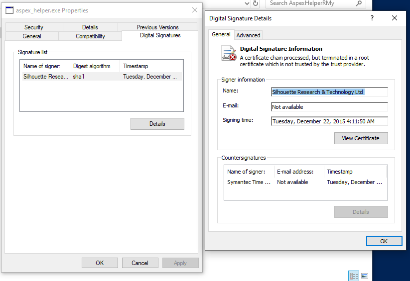
<figcaption>Digital signature information of
<code>aspex_helper.exe</code></figcaption>
</figure>

The executable itself contains minimal functionality. Its main purpose
is to load the malicious DLL (`RBGUIFramework.dll`) through DLL
side-loading. The file acts as a decoy loader and does not directly
implement malicious logic.

The relevant portion of the decompiled code responsible for loading the
DLL is shown below:

<figure data-latex-placement="H">
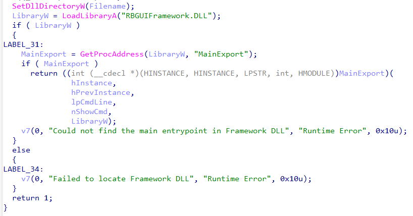
<figcaption>Decompiled code of <code>aspex_helper.exe</code> showing DLL
loading behavior</figcaption>
</figure>

## Stage 2: RBGUIFramework.dll

Once the DLL is loaded, follow the execution of the main exported
function. During its initialization routine, the function locates and
reads the associated `.dat` payload file. The contents of this file are
then decrypted using the hard-coded RC4 key:

<div class="center">

`LFMLljmhosPJfRHe`

</div>

The decryption routine is performed via the malware’s internal function
`mw_RC4Encryptpayload`. The relevant code region from the decompiler is
shown below.

<figure data-latex-placement="H">
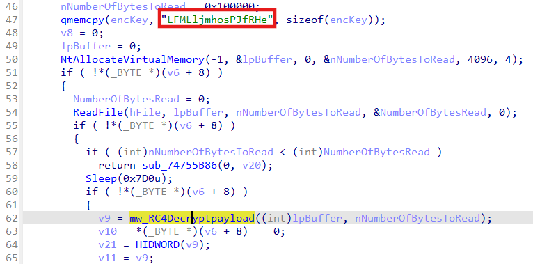
<figcaption>Decompiled code reading and decrypting <code>.dat</code>
file.</figcaption>
</figure>

### Manual Payload Decryption

For analysis purposes, the payload can also be decrypted manually using
a Python implementation of the same RC4 routine. The following script
accepts an input file and produces the decrypted output file:

``` python
import sys

def rc4_transform(blob: bytes, secret: str) -> bytes:
    k = secret.encode
    box = list(range(256))
    y = 0

    # KSA
    for x in range(256):
        y = (y + box[x] + k[x % len(k)]) % 256
        box[x], box[y] = box[y], box[x]

    # PRGA
    a = b = 0
    result = bytearray

    for ch in blob:
        a = (a + 1) % 256
        b = (b + box[a]) % 256
        box[a], box[b] = box[b], box[a]
        idx = (box[a] + box[b]) % 256
        result.append(ch ^ box[idx])

    return bytes(result)


secret_key = "LFMLljmhosPJfRHe"
src = sys.argv[1]
dst = sys.argv[2]

with open(src, "rb") as f:
    encrypted = f.read

decrypted = rc4_transform(encrypted, secret_key)

with open(dst, "wb") as f:
    f.write(decrypted)
```

This script can be used to decrypt the payload manually during offline
analysis.

<figure data-latex-placement="H">
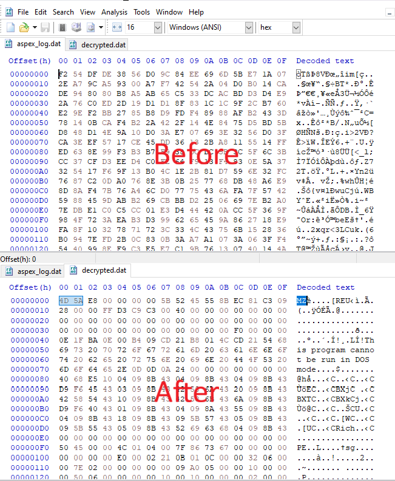
<figcaption>Payload before and after RC4 decryption.</figcaption>
</figure>

After decrypting the `.dat` file, the malware allocates memory, writes
the decrypted payload into it, and sets appropriate memory protections
to enable execution. The process involves:

- Allocating memory via `NtAllocateVirtualMemory`.

- Writing the decrypted payload to the allocated memory using
  `ZwWriteVirtualMemory`.

- Changing memory protection to executable using
  `ZwProtectVirtualMemory`.

- Registering the entry point of the decrypted payload as a callback
  through `EnumSystemGeoID`.

Interestingly, the malware uses `EnumSystemGeoID` to indirectly invoke
the pointer to the decrypted payload stored in `lpGeoEnumProc`. This
allows the payload to execute entirely in memory without being written
to disk, a common fileless malware technique.

<figure data-latex-placement="H">
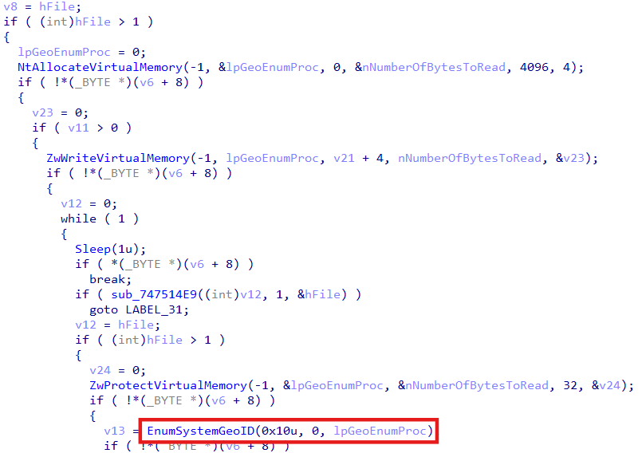
<figcaption>Decompiled code for memory allocation and callback setup for
payload execution</figcaption>
</figure>

## Stage 3: Reflective DLL Loader

Once the `EnumSystemGeoID` API is invoked, execution is transferred
directly into the decrypted payload, which is treated as shellcode. The
first bytes of this payload contain a Reflective DLL Loading stub
responsible for redirecting program flow into the main reflective loader
embedded within the decrypted DLL. This mechanism allows the payload to
be mapped and executed entirely in memory without ever touching disk.

<figure data-latex-placement="H">
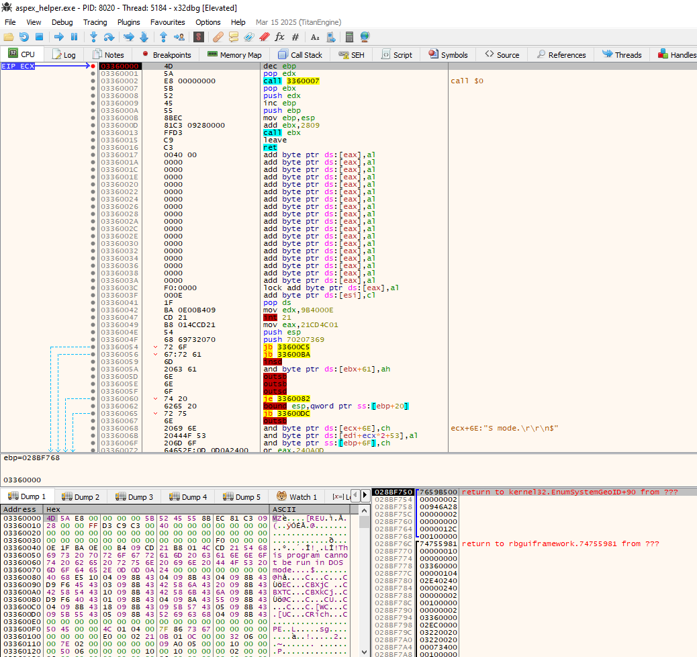
<figcaption>Reflective loader stub at the beginning of the decrypted
payload</figcaption>
</figure>

The reflective loader serves as the only exported function within the
decrypted DLL, named `RunInit`, which is later invoked to begin
execution of the final PlugX stage.

<figure data-latex-placement="H">
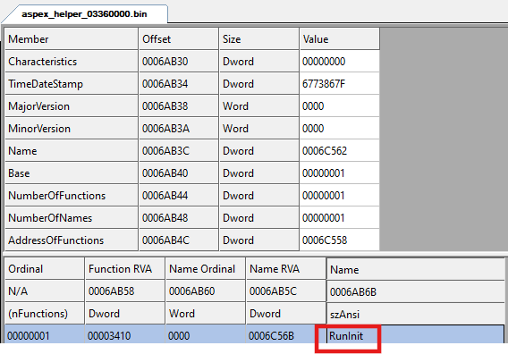
<figcaption>Export table showing the single exported function
<code>RunInit</code></figcaption>
</figure>

## Stage 4: The Final Payload

### Overview of Final Payload Behavior

The malware’s execution logic is highly dependent on the number of command‑line arguments passed during initialization. Upon execution, the payload processes these arguments to select distinct execution paths—ranging from persistence setup and privilege elevation to process injection—before ultimately converging into its primary operational routine.

<div class="landscape">

<figure data-latex-placement="H">

<figcaption>Final Payload’s control flow overview</figcaption>
</figure>

</div>

<span id="tab:arg_logic" label="tab:arg_logic"></span>

<div id="tab:arg_logic">

| **Argc** | **Execution Behavior** |
|:--:|:---|
| 1 | Sets up persistence. Checks privilege level: if running as a standard user, it calls `MainRoutine`; if running as Admin, it exits normally. |
| 2 | Configures UAC bypass using `fodhelper.exe` to elevate privileges to re-runs the malware with 3 additional arguments (resulting in argc = 4). |
| 3 | Decoy Folder Open: Forces a fresh Explorer window of the host drive to appear while closing the original window, tricking the user into believing they successfully opened a folder. Then proceeds similarly to the `argc = 1` case. |
| 4 | Checks the injection flag in the configuration. If the flag is set, it injects the encrypted payload (`aspex_log.dat`) into `dllhost.exe` and re-runs the malware with 4 additional arguments (resulting in argc = 5). Otherwise, it calls `MainRoutine`. |
| 5 | Directly invokes `MainRoutine`. |

Control Flow Logic by Argument Count

</div>

At the core of these paths is the `MainRoutine` function. Once reached,
this routine carries out the payload’s main malicious activities. It
systematically enumerates all connected removable USB drives and infects
each one to support self‑propagation. In addition, it establishes and
maintains communication with the attacker’s command‑and‑control (C2)
server, enabling remote command execution and data transmission.

### Obfuscation Techniques

The malware employs a heavily obfuscated and non‑uniform string decoding
technique to conceal API names. Each obfuscated string is reconstructed
at runtime using a sequence of operations such as writing hardcoded
32‑bit or 64‑bit values into a local buffer, followed by byte‑wise
transformations (e.g., XOR with loop‑dependent values, arithmetic
offsets, or position‑based mutations). The two code samples below
illustrate this behavior: although the overall goal is the same, each
routine uses a different combination of constants, offsets and XOR
operations, making it difficult to identify a single decoding pattern.

<figure data-latex-placement="H">
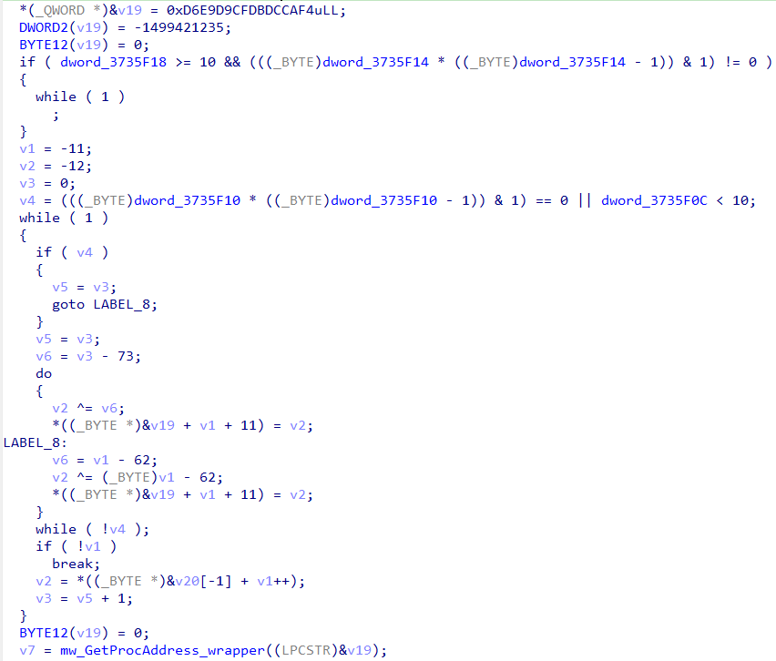
<figcaption>String obfuscation routine (example 1).</figcaption>
</figure>

<figure data-latex-placement="H">
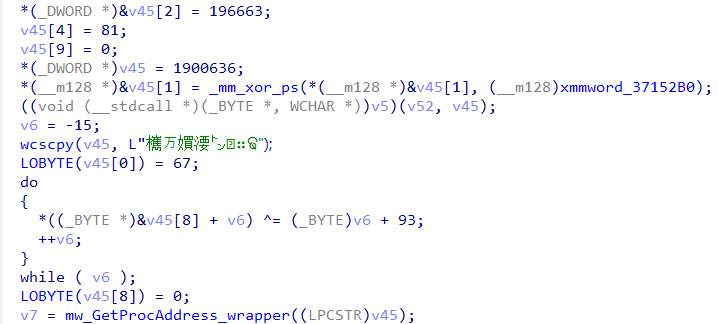
<figcaption>String obfuscation routine (example 2).</figcaption>
</figure>

After the obfuscated bytes are transformed into a readable ASCII string,
the malware passes the resulting buffer directly to its internal
API‑resolution wrapper `mw_GetProcAddress_wrapper`), which ultimately
calls `GetProcAddress`. This allows the sample to dynamically resolve
Windows API functions while ensuring that none of the function names
exist in plaintext within the binary.

### Single Instance Enforcement via Mutex

To ensure stability and prevent resource conflicts, the malware
implements a strict single-instance policy for its core threads and
worker routines. This is achieved through the systematic use of named
Mutexes.

For every distinct worker thread or malware instance, a unique Mutex
name is generated. Upon initialization, the routine attempts to acquire
this Mutex using the `CreateMutexW` API. The code immediately checks the
result using `GetLastError`.

- **Already Exists:** If the error code corresponds to
  `ERROR_ALREADY_EXISTS`, the malware recognizes that an instance of
  this specific routine is already running. It consequently aborts the
  current function execution to prevent duplication.

- **New Instance:** If the Mutex is successfully created, the thread
  "owns" the object and proceeds to execute its malicious payload.

<figure id="fig:mutex_check" data-latex-placement="H">

<figcaption>Decompiled code showing the Mutex creation and existence
check.</figcaption>
</figure>

**Analyst Note regarding API Resolution Wrappers:**

Throughout this report and the detailed screenshots, functions appearing
with names such as  
`mw_resolveaddress_X` (e.g., `mw_resolveaddress_2`,
`mw_resolveaddress_9`) are functionally identical to the
`mw_GetProcAddress_wrapper` described in the *Obfuscation Techniques*
section. These represent different compiled instances of the same
dynamic API resolution logic, used by various threads to reconstruct API
pointers at runtime without exposing them in the Import Address Table
(IAT).

### Decrypting Config Data

The malware stores its configuration settings in an encrypted global
buffer. Static analysis of the code reveals that the binary utilizes the
RC4 stream cipher to decrypt this information at runtime.

<figure data-latex-placement="H">
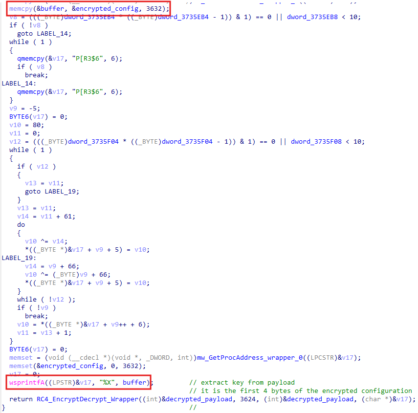
<figcaption>Decompiled routine responsible for decrypting the embedded
configuration data.</figcaption>
</figure>

The decryption routine performs the following operations:

1.  **Key Extraction:** The code reads the first 4 bytes of the
    encrypted blob. As seen in the raw data, these bytes are
    `0x7A 0x27 0x02 0x00`. The malware uses `wsprintfA` with the `"%X"`
    format specifier to convert these bytes into a hexadecimal string,
    which serves as the RC4 decryption key.

2.  **Payload Decryption:** The remaining 3624 bytes of the buffer
    (offsets following the key) constitute the actual encrypted
    configuration.

3.  **RC4 Execution:** The function `RC4_EncryptDecrypt_Wrapper` is
    invoked with the derived key and the encrypted payload to recover
    the plaintext data.

<figure data-latex-placement="H">
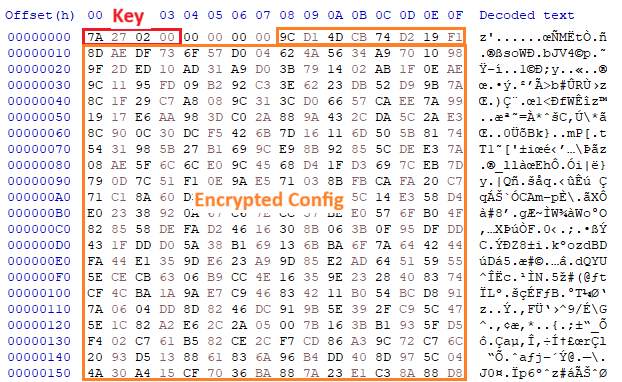
<figcaption>Encrypted configuration blob in HxD: first 4 bytes are used
as the RC4 key.</figcaption>
</figure>

<figure data-latex-placement="H">
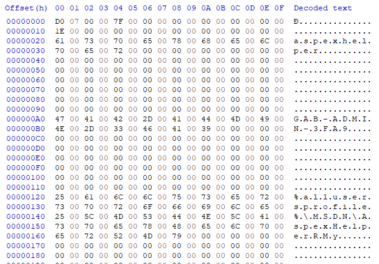
<figcaption>Decrypted configuration data extracted from the final
payload</figcaption>
</figure>

<figure id="fig:c2_config_addresses" data-latex-placement="H">
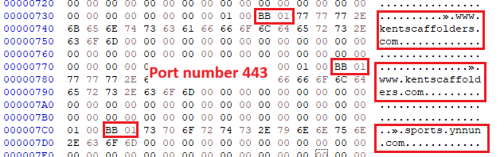
<figcaption>Extracted C2 server addresses and ports from the decrypted
configuration.</figcaption>
</figure>

### Compromised Host Fingerprinting

The malware establishes a distinct identity for each infected host by
assigning a unique "fingerprint." This identifier serves a dual purpose:
it allows the Command and Control (C2) server to differentiate between
victims for precise tasking, and it acts as the directory name for the
hidden staging folders created on infected USB drives.

It is retrieved directly from the malware’s embedded configuration data.
The ID consists of a 16-byte hexadecimal string, formatted using the
following pattern:

<div class="center">

`%2.2X%2.2X%2.2X%2.2X%2.2X%2.2X%2.2X%2.2X`

</div>

To ensure the ID remains persistent across reboots and subsequent
executions, the malware writes the generated VictimID to the Windows
Registry. It targets both the machine-wide and user-specific hives under
the `ms-pu` key:

- `HKEY_LOCAL_MACHINE\Software\CLASSES\ms-pu\CLSID`

- `HKEY_CURRENT_USER\Software\CLASSES\ms-pu\CLSID`

<figure id="fig:host_fingerprinting" data-latex-placement="H">
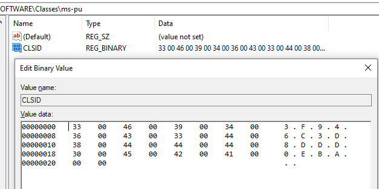
<figcaption>Registry artifact showing the persistent ID stored in the
<code>ms-pu</code> key.</figcaption>
</figure>

### Privilege Level Detection

The malware evaluates the current process’s privilege level and assigns
a numeric value indicating the type of access. These values can be
interpreted as follows:

<span id="tab:privilege_levels" label="tab:privilege_levels"></span>

<div id="tab:privilege_levels">

| **Code** | **Privilege Description** |
|:--:|:---|
| 0 – Standard User (Not Admin) | The process is running with Medium or Low integrity and has no administrative privileges. The user is not a member of the local Administrators group. Even if UAC is enabled, there is no split token because the user has no administrative token to split. Administrative actions require providing an administrator’s credentials; simply approving a UAC prompt is insufficient. |
| 1 – Full Admin (Elevated) | The process is running with High integrity and has full administrative privileges. This occurs when the user explicitly launches the application with "Run as Administrator," uses the built-in Administrator account, or UAC is disabled globally. The application has unrestricted access to system resources. |
| 2 – Limited Admin (UAC Active) | The process is running with Medium integrity, but the user is a member of the Administrators group. UAC has filtered administrative privileges from the current token (split token). The user has administrative potential but is not currently exercising it; elevation is required to perform administrative actions. |

Privilege Level Codes and Their Meaning

</div>

### Establishing Persistence

Before creating its persistence mechanisms, the malware first attempts
to copy its core components (the ‘.exe‘, ‘.dll‘, and ‘.data‘ files) into
a fixed installation directory defined in its configuration. The primary
target location is: `%ALLUSERSPROFILE%\MSDN\AspexHelperRMy\`

If the malware does not have sufficient privileges to write to this
directory, it falls back to a user‑specific path:
`%USERPROFILE%\AspexHelperRMy\`

<figure id="fig:payload_copy_msdn" data-latex-placement="H">
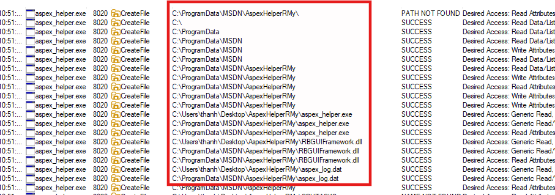
<figcaption>The malware copies all of its payload
components.</figcaption>
</figure>

#### Scheduled Task–Based Persistence With Sufficient Privilege

After determining the current privilege level, if the returned value is
**1** (indicating the process is running with full administrative
privileges), the malware proceeds to establish persistence by creating
two scheduled tasks—both named `AspexUpdateTask`. These tasks are
configured to execute the malware every 30 minutes with three randomly
generated arguments.

    SCHTASKS.exe /create /sc minute /mo 30 /tn "AspexUpdateTask" ^
    /tr "\"%ALLUSERSPROFILE%\MSDN\AspexHelperRMy\aspex_helper.exe\" rand1 rand2 rand3" ^
    /ru "SYSTEM" /f

    SCHTASKS.exe /create /sc minute /mo 30 /tn "AspexUpdateTask" ^
    /tr "\"%ALLUSERSPROFILE%\MSDN\AspexHelperRMy\aspex_helper.exe\" rand1 rand2 rand3" /f

Immediately after creating the task, the malware forces its execution
with:

    SCHTASKS.exe /run /tn "AspexUpdateTask"

<figure id="fig:schtask_log" data-latex-placement="H">
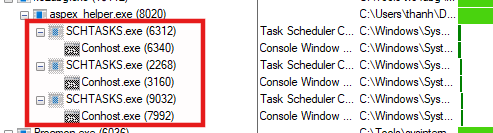
<figcaption>Execution log showing the malware creating and running the
scheduled task</figcaption>
</figure>

#### Registry-Based Persistence Under UAC-Limited Privileges

If the privilege-checking function instead returns a value of **2**
(indicating the process is running under a UAC-restricted or
non-elevated context), the malware opts for a user-level persistence
mechanism. In this case, it creates a registry entry named
`Aspex Update` under:

`HKEY_CURRENT_USER\Software\Microsoft\Windows\CurrentVersion\Run`

<figure id="fig:registry_run_key" data-latex-placement="H">
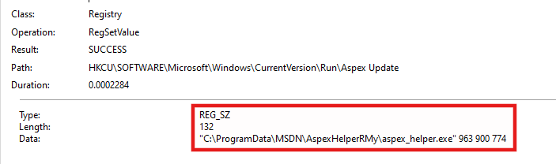
<figcaption>Registry entry created by the malware under
HKCU\…\Run</figcaption>
</figure>

The value is configured to launch the malware’s executable at user
logon, again supplying **three** randomly generated arguments. Unlike
the scheduled task method, this technique does not require
administrative privileges and therefore succeeds even when the process
is running without elevation.

*In both persistence scenarios—whether running with full administrative
privileges or under UAC-limited privileges—the malware ultimately
re-invokes itself with **argc = 4**. After completing the persistence
setup, the process terminates cleanly by returning **0**.*

### Bypass UAC via Fodhelper.exe (Case Argc = 2)

When the malware is executed with an argument count of 2, it initiates a
User Account Control (UAC) bypass routine to elevate its privileges from
Medium Integrity to High Integrity. This is a critical step for the
malware to gain full administrative control over the infected host
without alerting the user.

#### Registry Manipulation (CurVer Redirection)

The malware employs a "Fileless" UAC bypass technique involving registry
redirection. Instead of writing a DLL to disk, it manipulates the
registry keys associated with the `ms-settings` protocol.

Based on the dynamic analysis artifacts, the malware performs the
following two specific registry operations:

1.  **Redirecting ms-settings:** It targets the key
    `HKCU\Software\Classes\ms-settings\CurVer`. It sets the default
    value to `.pow`. This instructs Windows that the "Current Version"
    of the program used to handle `ms-settings` requests is defined by
    the ProgID `.pow`.

    <figure id="fig:curver_redirect" data-latex-placement="H">
    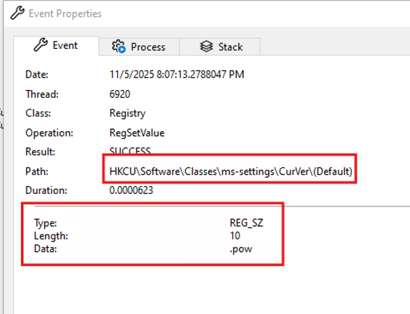
    <figcaption>Registry Event: Redirecting the ms-settings CurVer to the
    custom ProgID .pow</figcaption>
    </figure>

2.  **Defining the Malicious Command:** It then creates the new ProgID
    key at  
    `HKCU\Software\Classes\.pow\Shell\Open\command`. It sets the default
    value to the path of the malicious executable followed by three
    additional arguments.

    <figure id="fig:payload_command" data-latex-placement="H">
    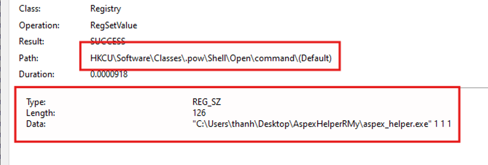
    <figcaption>Registry Event: Setting the final payload execution command
    inside the .pow ProgID</figcaption>
    </figure>

#### Triggering the Bypass

Once the registry is primed, the malware executes the Windows Features
on Demand Helper using the command line:

    C:\Windows\system32\cmd.exe /c fodhelper.exe

The process tree below captures this behavior, showing
`aspex_helper.exe` spawning `cmd.exe`, which in turn launches
`fodhelper.exe`.

<figure id="fig:fodhelper_trigger" data-latex-placement="H">
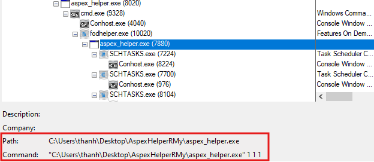
<figcaption>The malware spawning cmd.exe to trigger the vulnerable
fodhelper.exe binary.</figcaption>
</figure>

**Mechanism of Execution:**

1.  **Auto-Elevation:** `fodhelper.exe` is a trusted Windows binary
    located in `System32` that possesses a manifest with
    `autoElevate=true`. When executed by a user in the Administrators
    group, it runs with High Integrity without prompting the user (no
    UAC pop-up).

2.  **Protocol Lookup:** Upon launch, `fodhelper.exe` attempts to open
    the `ms-settings` protocol to display system settings.

3.  **Registry Hijack:** Because of the registry modifications shown in
    Figure <a href="#fig:curver_redirect" data-reference-type="ref"
    data-reference="fig:curver_redirect">2.7</a>, `fodhelper` follows
    the `CurVer` pointer to `.pow` and executes the command defined in
    `.pow\Shell\Open\command` (shown in Figure
    <a href="#fig:payload_command" data-reference-type="ref"
    data-reference="fig:payload_command">2.8</a>).

4.  **Privilege Inheritance:** Since `fodhelper.exe` is running as an
    elevated Administrator, the child process it spawns (the malware)
    inherits this High Integrity token.

As a result, `aspex_helper.exe` is re-executed with 3 additional
arguments (total argc = 4) and full administrative privileges, allowing
it to proceed to the next stage of infection.

### Process Injection via dllhost.exe (Case Argc = 4)

When the malware is executed with an argument count of 4, it does not
immediately execute the main payload. Instead, it consults its decrypted
configuration data to determine the next course of action.

#### Configuration Check

The malware checks a specific flag within its configuration structure.
As seen in the decompiled code below, if this flag is set (non-zero),
the control flow is redirected to the `injection_routine`. If the flag
is not set, it proceeds directly to `mw_main`.

<figure id="fig:injection_flag_check" data-latex-placement="H">
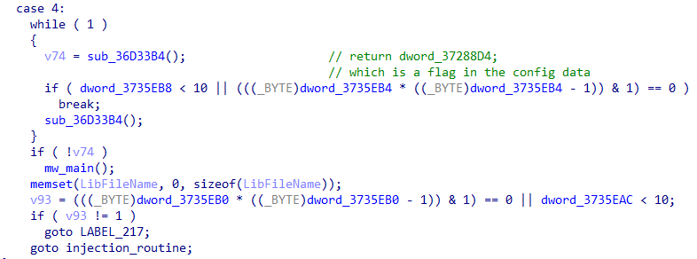
<figcaption>Decompiled logic for Argc=4: Checking the configuration flag
to trigger injection.</figcaption>
</figure>

#### The Injection Routine

If the injection flag is active, the malware initiates a process
injection sequence targeting the legitimate Windows system component
`%windir%\system32\dllhost.exe`. This technique is used to mask the
malware’s activity behind a trusted system process.

The routine follows these specific steps:

**1. Reading the Payload**  
First, the malware resolves the path to the encrypted payload file,
`aspex_log.dat`. It reads the entire content of this file into a locally
allocated memory buffer.

<figure id="fig:read_payload" data-latex-placement="H">

<figcaption>Reading the content of aspex_log.dat into
memory.</figcaption>
</figure>

**2. Spawning the Target Process**  
The malware then launches a new instance of `dllhost.exe` using
`CreateProcessW`. Notably, it constructs a command line with **4
additional arguments** (e.g., `rand1 rand2 rand3 rand4`), which
effectively sets up the next stage of execution (Argc = 5).

The process creation flag is set to **20** (Decimal), which typically
corresponds to `CREATE_NEW_CONSOLE | CREATE_SUSPENDED`. This ensures the
legitimate process starts in a suspended state, allowing the malware to
modify its memory before it runs.

<figure id="fig:spawn_dllhost" data-latex-placement="H">
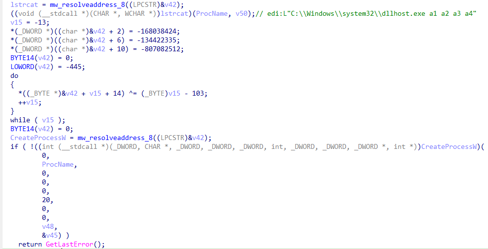
<figcaption>Spawning dllhost.exe in a suspended state with 4 dummy
arguments.</figcaption>
</figure>

**3. Injection and Execution**  
With the target process suspended, the malware performs standard
injection operations:

- **Allocation:** It calls `VirtualAllocEx` to allocate memory within
  the remote `dllhost.exe` process.

- **Writing:** It uses `WriteProcessMemory` to copy the buffer
  containing the `aspex_log.dat` content into the allocated remote
  memory.

- **Execution:** Finally, it invokes `CreateRemoteThread` to start a new
  thread in the remote process that executes the injected shellcode.

<figure id="fig:remote_thread_injection" data-latex-placement="H">
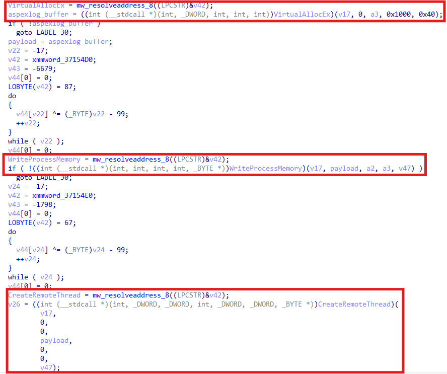
<figcaption>Writing payload to remote memory and creating a remote
thread.</figcaption>
</figure>

Although the injection routine appears structurally sound at first
glance, it contains a significant logical flaw. The malware loads the
encrypted `aspex_log.dat` payload from disk and writes it directly into
the memory of the remote process *without* decrypting it beforehand.

Because the payload remains encrypted, executing it inside the target
process would immediately result in invalid instructions, causing
`dllhost.exe` to crash. This strongly suggests a mistake in the
implementation or that this section of code is a leftover from other
PlugX variants where the full decryption-and-injection workflow was
correctly implemented.

### Core Malicious Logic: The Main Routine

Upon entering the final stage, the malware executes its primary
operations. Despite the decompiled code displaying loop structures and
conditional checks, the actual execution flow proceeds directly through
three core functions in order.

<figure id="fig:main_routine_linear" data-latex-placement="H">
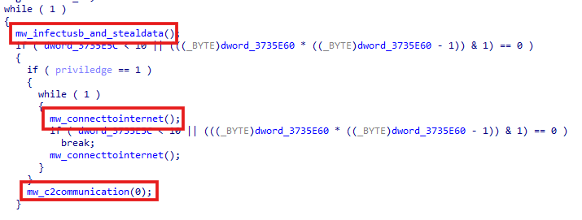
<figcaption>The main routine executing the three core functions
sequentially.</figcaption>
</figure>

The malware executes the following functions sequentially:

1.  **mw_infectusb_and_stealdata**: Contains the core logic of USB
    infection.

2.  **mw_connecttointernet**: Periodically steals Wi-Fi credentials and
    attempts to use them to restore internet connectivity if offline.

3.  **mw_c2communication**: Performs C2 communication.

#### USB Infection

**Defense Evasion and Environment Sanitization**

The first major component called within the sequence is
`mw_infectusb_and_stealdata`. Before attempting to propagate, this
function invokes a protective subroutine, `mw_protect_malware`, designed
to sanitize the environment.

This routine serves a dual purpose: ensuring the stability of the
malware by removing competing applications and evading detection by
disabling specific security products.

<figure id="fig:mw_protect" data-latex-placement="H">
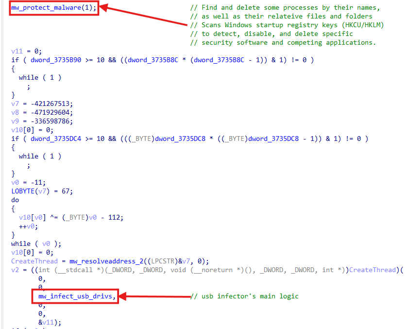
<figcaption>Protection and USB infection thread
initialization.</figcaption>
</figure>

##### Targeted Process Termination and Cleanup

  
The malware takes a snapshot of all running processes on the system to
identify potential threats. It iterates through this snapshot and
compares every process name against a hardcoded blocklist.

If a match is found, the malware employs a dual-method approach to
ensure the target is neutralized. First, it attempts to forcibly
terminate the process tree using the Windows Command Processor:

<div class="center">

`C:\Windows\system32\cmd.exe /c taskkill /t /f /pid %d`

</div>

In addition to the command-line approach, it also directly invokes the
native Windows API  
`TerminateProcess(hproc, 0)` on the target process handle.

The blocklist targets a mix of USB-focused security tools (e.g.,
Smadav), standard antivirus solutions (e.g., Avast, Symantec), and
potentially other malware or system utilities. The full list of targeted
processes is detailed below:

<span id="tab:process_blocklist" label="tab:process_blocklist"></span>

<div id="tab:process_blocklist">

|                      |                    |                   |
|:---------------------|:-------------------|:------------------|
| SZBrowser.exe        | SmadavProtects.exe | SmadavProtect.exe |
| Microsoft_Photos.exe | Microsoft_Caps.exe | HpDigital.exe     |
| EwsProxy.exe         | AssistPro.exe      | AvastNM.exe       |
| AvastSvc.exe         | acrotrays.exe      | AcroRd32.exe      |
| AAM Update.exe       | AAM Updates.exe    | AdobeUpdate.exe   |
| AdobeUpdates.exe     | AdobeHelper.exe    | Symantec.exe      |
| PowerUtility.exe     |                    |                   |

Blocklist of Processes Targeted for Termination

</div>

Following the termination of the targeted processes, the malware
executes a cleanup routine to permanently disable the security software.
This process involves two distinct steps: physical file removal and
persistence removal.

First, the malware locates the executable files associated with the
terminated processes on the disk and attempts to delete them. This
prevents the security tools from being manually restarted by the user or
triggered by other system components.

Second, to ensure these applications do not launch automatically upon
system reboot, the malware scans the standard Windows startup registry
keys:

- `HKEY_LOCAL_MACHINE\Software\Microsoft\Windows\CurrentVersion\Run`

- `HKEY_CURRENT_USER\Software\Microsoft\Windows\CurrentVersion\Run`

It iterates through the values within these keys. If it identifies an
entry matching the name of a blocked application, it deletes the
registry value, thereby removing the software’s persistence mechanism.

##### USB Drive Enumeration and Infection Logic

  
The `mw_infect_usb_drivs` function acts as the primary controller for
propagation. It executes an infinite loop that periodically calls  
`GetLogicalDriveStringsW` to enumerate all mounted volumes on the
system.

For every detected volume, the code verifies if the device is a
removable USB drive via the helper function `mw_CheckIfIsUsbDevice`.
Upon validating a target drive, the malware spawns three distinct worker
threads to concurrently manage the infection and data theft process:

1.  `mw_ManageUsbDriveInfection`

2.  `mw_ManageUsbDataTheft`

3.  `mw_RunSomeBatScript`

<figure id="fig:usb_infection_threads" data-latex-placement="H">
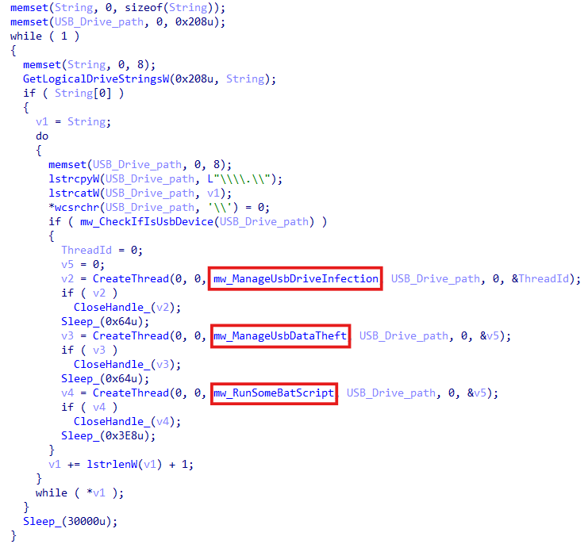
<figcaption>The USB infection routine spawning three worker threads for
each detected drive.</figcaption>
</figure>

##### Experimental Setup Note

  
For the purpose of this analysis, the malware’s propagation behavior was
observed in a controlled environment. A virtual disk (Drive `E:`) was
mounted within the virtual machine and explicitly configured to simulate
the properties of a removable USB mass storage device. This setup
successfully deceived the malware’s drive type detection logic, allowing
for the execution of the full infection chain.

<figure id="fig:test_usb_setup" data-latex-placement="H">
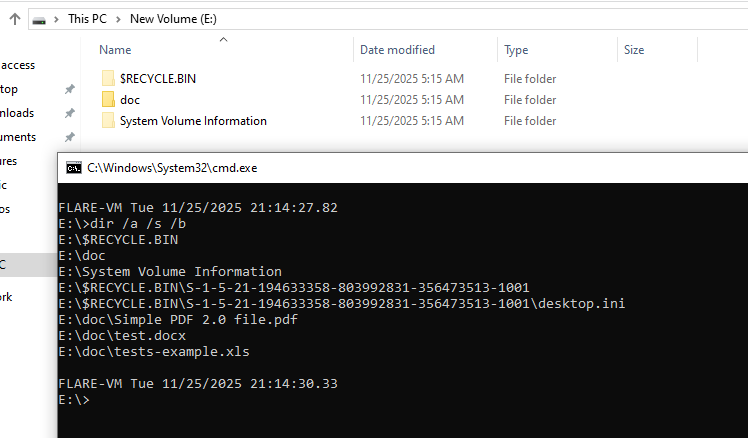
<figcaption>The simulated USB drive (Drive E:) containing user data
before infection.</figcaption>
</figure>

#### Thread 1: Manage Usb Drive Infection

**Enforcing Stealth via Registry Manipulation** The first thread
initiates a persistent loop that executes every 2 minutes. Its primary
objective is to modify the Windows Explorer settings to aggressively
conceal the malware’s presence.

It targets the key
`HKCU\Software\Microsoft\Windows\CurrentVersion\Explorer\Advanced` and
forcibly sets the following values:

- **Hidden**: Set to **0** to disable the display of files with the
  "Hidden" attribute.

- **ShowSuperHidden**: Set to **0** to disable the display of protected
  operating system files.

- **HideFileExt**: Set to **1** to hide file extensions for known file
  types.

<figure id="fig:procmon_hidden_registry" data-latex-placement="H">
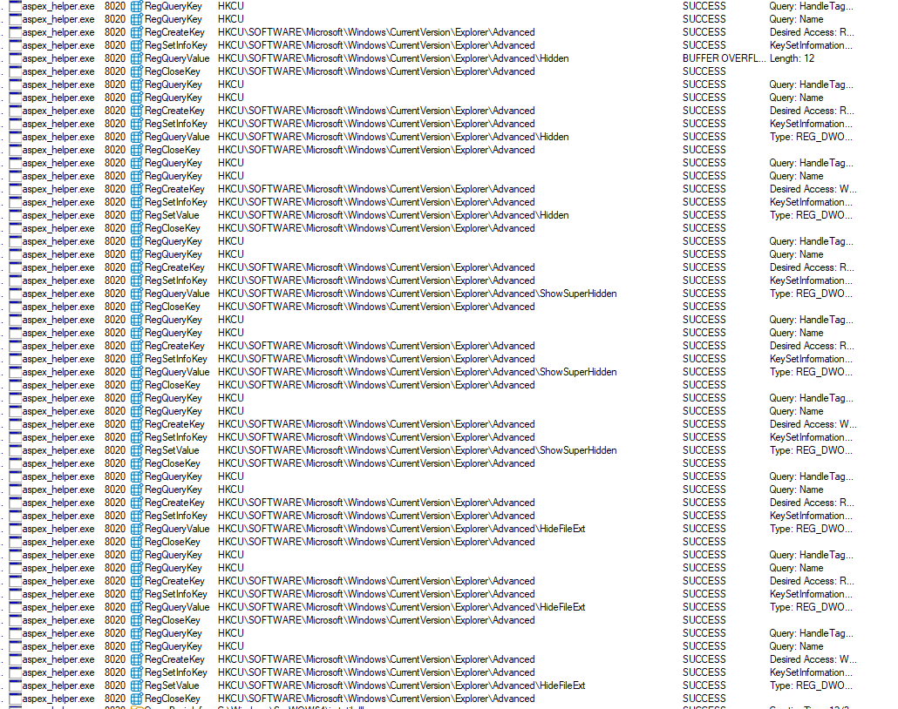
<figcaption>ProcMon capture of malware enforcing hidden file
settings.</figcaption>
</figure>

By continuously reverting these settings, malware ensures that its
payloads, which are likely marked as hidden or system files—remain
invisible to the user, complicating manual detection and removal.

##### Pre-Infection Validation and Safeguards

  
Before performing any usb infection, the malware conducts a structured
validation sequence to decide whether the attached USB drive qualifies
for infection. As illustrated in
Figure <a href="#fig:preinfectionlogic" data-reference-type="ref"
data-reference="fig:preinfectionlogic">2.19</a>, the decision process
evaluates three factors: (i) device fingerprinting, (ii) host-side
infection history, and (iii) a global propagation policy.

<figure id="fig:preinfectionlogic" data-latex-placement="H">
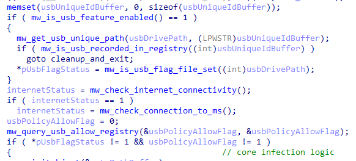
<figcaption>Decompiled pre-infection decision logic.</figcaption>
</figure>

The routine begins by checking whether the malware’s USB-propagation
component in its config data is enabled through
`mw_is_usb_feature_enabled`(for this sample, this specific component is
not enabled). If the feature is active, the malware derives a
device-specific identifier via `mw_get_usb_unique_path`, which resolves
the physical interface path of the connected USB drive.

Next, the malware queries a tracking registry value using
`mw_is_usb_recorded_in_registry` to determine whether this specific USB
identifier has previously been processed on the host. The registry path
involved belongs to:
``` math
\texttt{HKEY\_CURRENT\_USER\textbackslash System\textbackslash CurrentControlSet\textbackslash Control\textbackslash Network}
```

- **If the lookup returns `true`**, execution jumps to a cleanup
  routine, bypassing all further infection attempts.

- **Purpose:** This acts as a host-side idempotency check to prevent
  redundant processing of drives that are already known to the
  compromised system.

If the USB device has not been previously recorded, the malware
evaluates a device-side marker by calling `mw_is_usb_flag_file_set`.
This function inspects a file on the USB drive (typically
`desktop.ini`); if the first byte is the value “1”, the routine returns
`1`, signaling the device is already marked as infected.

The malware then calls `mw_query_usb_allow_registry` to read the policy
value stored at:
``` math
\texttt{HKEY\_CURRENT\_USER\textbackslash System\textbackslash CurrentControlSet\textbackslash Control\textbackslash Network\textbackslash allow}
```
The retrieved value is written into `usbPolicyAllowFlag`, where a value
of `1` disables all USB infection behavior.

The transition into the infection stage is therefore protected by a
strict gate condition:

``` objectivec
// Proceed ONLY if the USB is not marked AND the global kill-switch is not enabled
if ( *pUsbFlagStatus != 1 && usbPolicyAllowFlag != 1 )
{
    // ... core infection logic begins ...
}
```

This combination of per-device markers, host-level tracking, and a
global policy ensures the malware avoids redundant infections, remains
stealthy, and honors remote operator constraints.

##### Payload Staging and Persistence

  
The malware initiates a multi-stage process to establish a hidden staging ground and synchronize its payload components.

The malware first ensures the existence of its installation
directories:  
`E:\Firmware\` and `E:\Firmware\vault\`. To evade casual detection by
users, it immediately modifies the file attributes of these directories
using the API `SetFileAttributesW`.

As observed in the analysis, the malware pushes the argument `7` onto
the stack before calling the API. This corresponds to the bitwise OR
combination of:

- `FILE_ATTRIBUTE_READONLY (0x1)`

- `FILE_ATTRIBUTE_HIDDEN (0x2)`

- `FILE_ATTRIBUTE_SYSTEM (0x4)`

<figure id="fig:createfirmware" data-latex-placement="H">
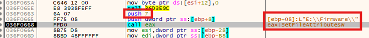
<figcaption>The malware calls <code>SetFileAttributesW</code> with flag
<code>0x7</code> on the root <code>Firmware</code>
directory.</figcaption>
</figure>

<figure id="fig:createfirmwarevault" data-latex-placement="H">
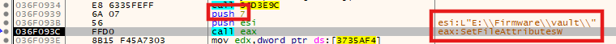
<figcaption>The same hidden/system attributes are applied to the
<code>vault</code> sub-directory.</figcaption>
</figure>

To further disguise the malicious directory as a legitimate system
folder, the malware creates a `desktop.ini` file inside `E:\Firmware\`.
Within this file, it embeds the CLSID, which corresponds to the Windows
Explorer “Favorites” shell folder. By assigning this CLSID, the malware
causes the directory to inherit the appearance and behavior of the
Favorites folder, enhancing its stealth.

**Injected Configuration:**

    [.ShellClassInfo]
    CLSID={323CA680-C24D-4099-B94D-446DD2D7249E}

<figure id="fig:createdesktopini" data-latex-placement="H">
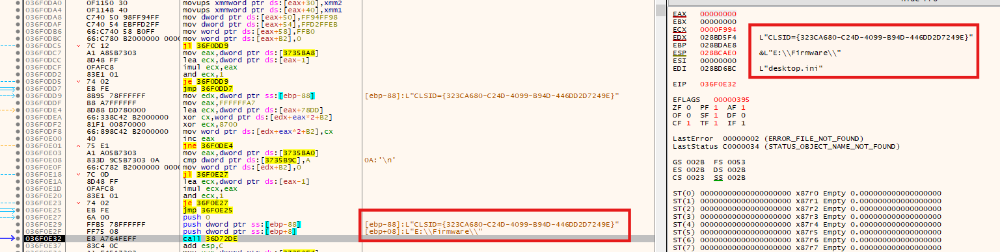
<figcaption><code>desktop.ini</code> generation and CLSID
construction.</figcaption>
</figure>

The malware employs a robust synchronization mechanism to copy its
binaries (`aspex_helper.exe`, `RBGUIFramework.dll`, and `aspex_log.dat`
files) to `E:\Firmware\vault\`.

It iterates through the required files and performs the following logic:

1.  **Existence Check:** It calls `GetFileAttributesW` to check if the
    file already exists on the USB.

2.  **First-Time Infection:** If the function returns `-1` (File Not
    Found), the malware immediately copies the payload from the host to
    the USB.

3.  **Update Logic:** If the file exists and an internet connection is
    available, the malware compares the file on the USB against the copy
    on the compromised host:

    - It checks if the file size has changed.

    - It compares the file modification timestamps to determine if the
      host version is newer.

    If either condition is met (size mismatch or older timestamp), the
    malware deletes the existing file on the USB and replaces it with
    the newer version from the host.

<figure id="fig:copypayloads" data-latex-placement="H">
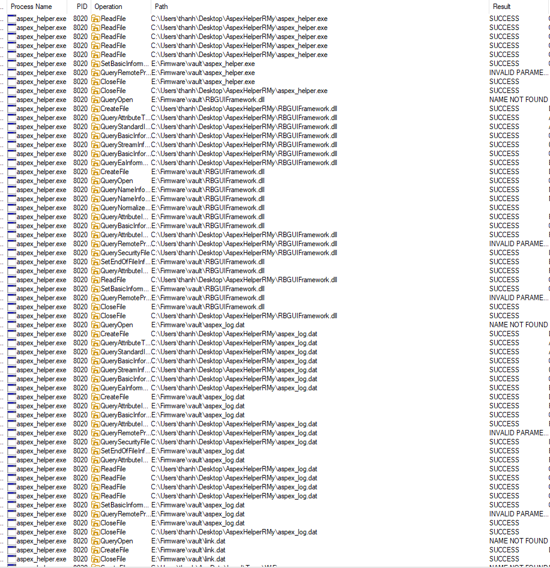
<figcaption>ProcMon capture of malware copying binaries to the hidden
vault.</figcaption>
</figure>

##### Encrypted Beacon Logging (link.dat)

  
In addition to the executable payloads, the malware manages a specific
data file located at `E:\Firmware\vault\link.dat`. Analysis of the
internal function `AppendBeaconToLog` indicates that this file serves as
a local, encrypted registry of infection "beacons" or unique
identifiers.

<figure id="fig:updatebeacon" data-latex-placement="H">
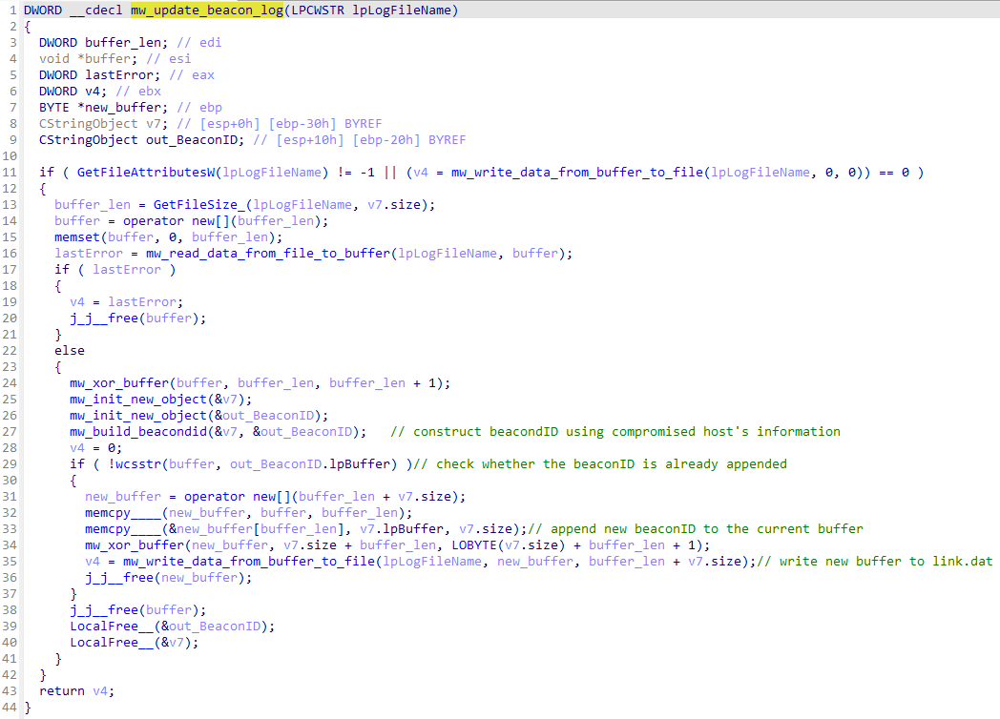
<figcaption>Decompiled routine for appending encrypted beacons to
link.dat.</figcaption>
</figure>

The malware utilizes a secure cycle to update this log:

1.  **Decryption & Verification:** It reads the existing file and
    decrypts the content into memory using the function `mw_xor_buffer`.
    Notably, the encryption key is dynamic and derived directly from the
    data size:

    <div class="center">

    `key = length(buffer) + 1`

    </div>

    It then scans the decrypted data to ensure the current Beacon ID has
    not already been recorded.

2.  **Data Appending:** If the ID is unique, the malware appends the new
    beacon information to the end of the decrypted buffer.

3.  **Re-Encryption & Update:** Finally, the expanded dataset is
    re-encrypted. Because the buffer size has increased, the key changes
    dynamically for this write operation, ensuring the log is always
    encrypted with a size-dependent key.

<figure id="fig:xorbuffer" data-latex-placement="H">
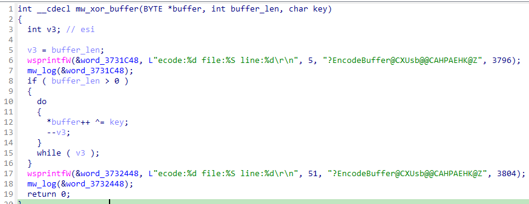
<figcaption>The <code>mw_xor_buffer</code> routine.</figcaption>
</figure>

This mechanism ensures the malware maintains a comprehensive history of
unique infections or sessions on the USB drive while preventing casual
inspection of the data via static encryption.

##### Conditional Staging: "Information Volume"

  
It is also worth noting that the malware exhibits a secondary file
staging behavior contingent on internet connectivity.

If an active internet connection is detected, the malware initializes a
directory on the USB drive named `Information Volume`. It then retrieves
a subdirectory identifier from its internal configuration data. In the
analyzed sample, this configuration value is set to “**2**”, resulting
in the target path:

<div class="center">

`[USB]:\Information Volume\2\`

</div>

The malware subsequently attempts to copy its payloads from the
host directory  
`%userprofile%\AspexHelperRMy\` to this new location on the USB drive.

##### WiFi Profile Synchronization

  
The malware executes a conditional synchronization routine for WiFi
configuration profiles (`.xml` files). The direction of data flow is
determined by the infected host’s internet connectivity status:

- **Online Mode:** Exfiltrates profiles from the host’s `%TEMP%\WiFi`
  directory to the USB’s hidden folder `\Information Volume\WiFi`.

- **Offline Mode:** Imports profiles from the USB drive to the host’s
  `%TEMP%` directory.

This mechanism ensures that captured network credentials are propagated
between infected air-gapped machines and internet-connected nodes.

<figure id="fig:wifisync" data-latex-placement="H">
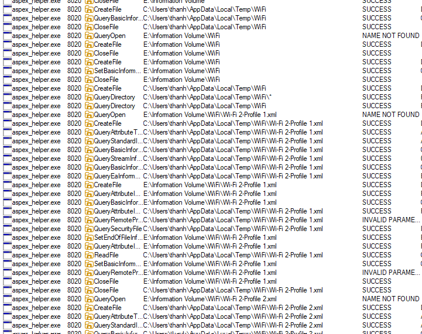
<figcaption>Exfiltrating WiFi profiles to USB (Online
Mode).</figcaption>
</figure>

##### Final Infection Stage: Deception and Persistence

  
Once the payload is staged, the malware executes its primary deception
routine. This involves a specific trick to hide legitimate user data and
replace it with a malicious entry point.

First, the malware creates a directory named with the Unicode character
`0x200B` (Zero Width Space). Because this character is non-printing, the
folder appears to have no name in Windows Explorer, and by applying
hidden/system attributes, it becomes effectively invisible to the user.

<figure id="fig:create0x200b" data-latex-placement="H">
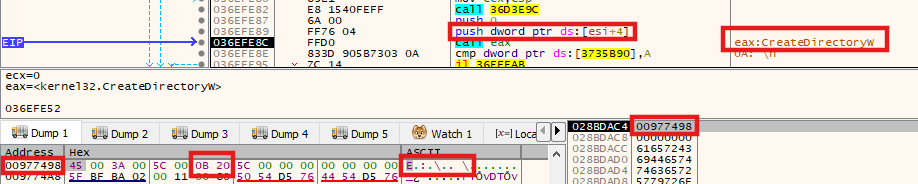
<figcaption>Code execution creating the directory with the 0x200B
name.</figcaption>
</figure>

<figure id="fig:foldercreated" data-latex-placement="H">
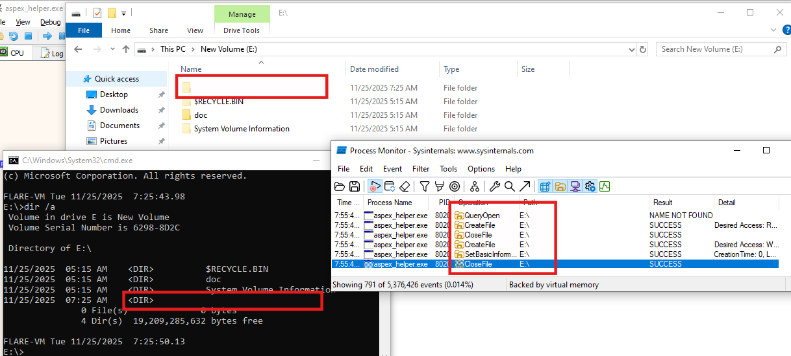
<figcaption>The resulting invisible folder on the file
system.</figcaption>
</figure>

The infection flow is orchestrated through a precise sequence of file
system manipulations:

1.  **Content Migration:** The malware moves all currently visible files
    and folders from the root of the USB drive into the hidden directory
    named with the Unicode zero-width space (`0x200B`).

2.  **Shortcut Generation:** Once the legitimate files are hidden, it
    generates a malicious LNK shortcut file in the root directory to
    serve as the deceptive entry point for the user.

This process results in a visual swap. Where the user previously saw
their documents, they now see only the malicious shortcut, which mimics
the drive’s volume name.

<figure id="fig:beforeinfection" data-latex-placement="H">

<figcaption>Pre-infection: Visible user files.</figcaption>
</figure>

<figure id="fig:afterinfection" data-latex-placement="H">
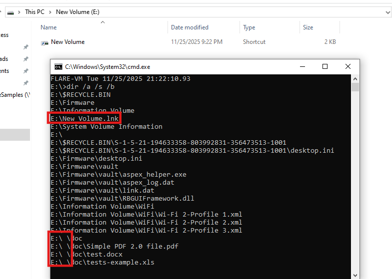
<figcaption>Post-infection: Only the malicious shortcut is
visible.</figcaption>
</figure>

The created shortcut is crafted to execute the malware payload while
tricking the user. The target field points to the Windows Command
Processor (`cmd.exe`) with specific arguments:

<div class="center">

`%comspec% /c "^Firmwa^re\vault\aspex_helper.exe rand1 rand2"`

</div>

**Technical Details:**

- **Obfuscation:** The caret symbols (`^`) are used to break
  string-based detection signatures (e.g., `^Firmwa^re` resolves to
  `Firmware`).

- **Execution Logic:** The malware is launched with two random arguments
  (`rand1 rand2`). This ensures the application starts with `argc = 3`.

<figure id="fig:maliciousshortcut" data-latex-placement="H">
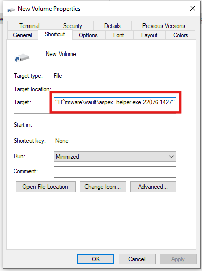
<figcaption>Shortcut properties showing the obfuscated target
path.</figcaption>
</figure>

#### Execution Flow: The Deception Routine (Case Argc = 3)

When a victim unknowingly clicks the malicious shortcut on the infected
USB drive, the malware is executed via `cmd.exe` with two random
arguments, as defined during the infection phase.

<figure id="fig:shortcutexecution" data-latex-placement="H">
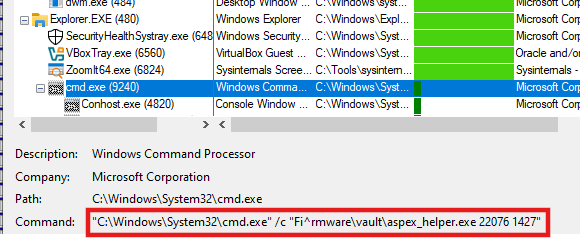
<figcaption>Process log showing the malware executing with 2 random
arguments.</figcaption>
</figure>

This execution triggers the `Case 3` logic within the malware’s main
argument switch (since `argc` includes the executable name plus two
arguments). The primary goal of this routine is to maintain the illusion
that the user has successfully opened their USB drive, while concealing
the fact that the malware is now running.

The malware immediately constructs the path to the hidden directory
containing the user’s legitimate data (e.g., `E:\[0x200B]\`). It then
invokes `ShellExecuteW` with the `"open"` verb.

<figure id="fig:shellexecute" data-latex-placement="H">
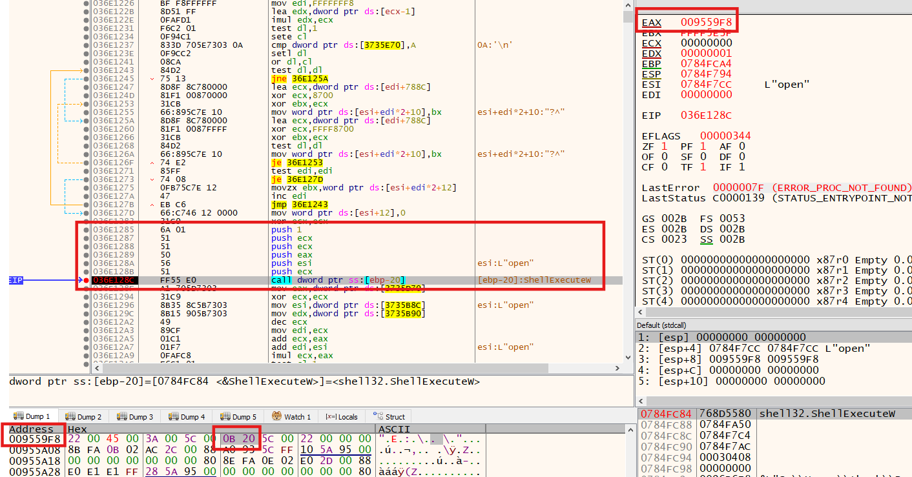
<figcaption>ShellExecuteW call opening the hidden folder.</figcaption>
</figure>

To the user, the resulting window appears indistinguishable from the
root of the drive. As shown below, the Explorer window displays the
user’s files (`doc` folder), successfully deceiving the victim.

<figure id="fig:onopentheshortcut" data-latex-placement="H">
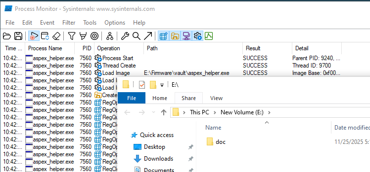
<figcaption>The malware opens the hidden folder, presenting legitimate
files to the user.</figcaption>
</figure>

To complete the illusion, the malware must close the original Explorer
window (the root of the USB drive containing the malicious shortcut) so
the user does not navigate back to it.

It achieves this by searching for the active Windows Explorer window
using the class name  
`"CabinetWClass"` via `FindWindowW`.

<figure id="fig:findwindow" data-latex-placement="H">
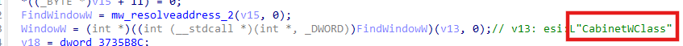
<figcaption>Locating the active Explorer window via
CabinetWClass.</figcaption>
</figure>

Once the window handle is retrieved, the malware sends a `WM_CLOSE`
message (Decimal `16` / Hex `0x10`) to that window using the
`SendMessageW` API. This forces the window to close immediately, leaving
only the newly opened "Decoy" window (the hidden folder) visible on the
screen.

<figure id="fig:sendmessage" data-latex-placement="H">
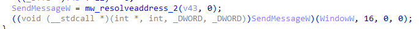
<figcaption>Sending WM_CLOSE (16) to terminate the previous
window.</figcaption>
</figure>

#### Thread 2: Manage USB Data Theft

The second worker thread is responsible for the bi-directional transfer
of data between the infected USB drive and the compromised host. As
illustrated in the decompiled code, the direction of this transfer is
entirely dependent on the host’s current internet connectivity status.

<figure id="fig:usbthread2" data-latex-placement="H">
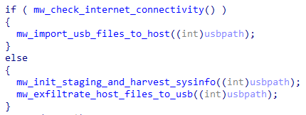
<figcaption>Decompiled code of the thread Manage USB Data
Theft</figcaption>
</figure>

##### Targeting Criteria: File Selection Filters

  
Regardless of the connectivity status, the data theft routine enforces
specific filtering criteria derived from the malware’s configuration
data to identify files of interest. The selection logic relies on three
numeric values found in its config data:

1.  **File Type Bitmask:** The malware utilizes a specific configuration
    byte (offset `0x788CC`) set to `0x7F` (Binary `01111111`) as a
    bitmask to target specific file extensions. This mapping prioritizes
    sensitive office documents:

    - **Bit 1 (0x01):** `.doc`

    - **Bit 2 (0x02):** `.docx`

    - **Bit 3 (0x04):** `.xls`

    - **Bit 4 (0x08):** `.xlsx`

    - **Bit 5 (0x10):** `.ppt`

    - **Bit 6 (0x20):** `.pptx`

    - **Bit 7 (0x40):** `.pdf`

    <figure id="fig:targetbitmask" data-latex-placement="H">
    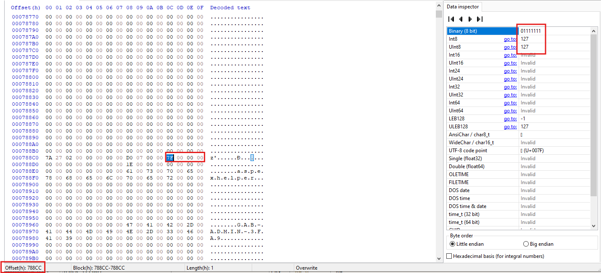
    <figcaption>Configuration byte defining the target file types
    (0x7F).</figcaption>
    </figure>

2.  **Recency Threshold:** A second configuration value (offset
    `0x788D8`), set to **30**, enforces a temporal limit. The malware
    calculates the difference between the current system time and the
    file’s last write time, ensuring only files modified within the last
    30 days are collected.

    <figure id="fig:targetrecency" data-latex-placement="H">
    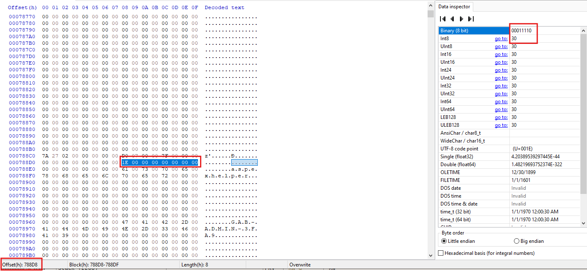
    <figcaption>Configuration value setting the recency limit to 30
    days.</figcaption>
    </figure>

3.  **Size Constraint:** A third configuration value (offset `0x788E0`),
    currently set to **0**, defines the maximum file size for
    exfiltration. In this sample, the value 0 implies that no size
    restriction is applied.

    <figure id="fig:targetsizelimit" data-latex-placement="H">
    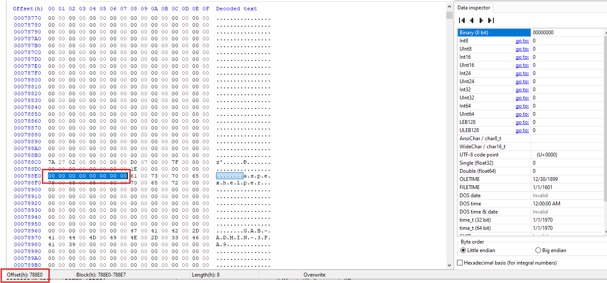
    <figcaption>Configuration value setting the size limit (0 =
    Unlimited).</figcaption>
    </figure>

##### Scenario A: Internet Available (Import to Host)

  
If the compromised host has an active internet connection, the malware
assumes the role of a "collection point." It executes
`mw_import_usb_files_to_host` to harvest data previously staged on the
USB drive and consolidates it on the connected host.

The routine performs the following actions:

1.  **Beacon Retrieval:** It attempts to copy the encrypted log file
    `E:\Firmware\vault\link.dat` to the host.

2.  **Data Harvesting:** It searches for specific directories on the USB
    drive, including:

    - `\Information Volume\2`

    - `\Information Volume\2\p`

    - `\Information Volume\2\p2`

    - `\System Volume Information`

Any matching content found is copied to the host’s staging directory
located at:

<div class="center">

`%AppData%\Roaming\Document\`

</div>

<figure id="fig:importlog" data-latex-placement="H">

<figcaption>ProcMon log showing data transfer from USB to
AppData.</figcaption>
</figure>

##### Scenario B: No Internet (Initialize Staging & Exfiltrate)

  
If the host is offline, the malware switches behavior to treat the USB
drive as a "mule" for data exfiltration. It first prepares the USB drive
by calling `mw_initialize_usb_staging_env`.

This initialization routine ensures the existence of the directory
structure `E:\Information Volume\2\`. To conceal these folders, it sets
their file attributes to `0x7` (Read-Only \| Hidden \| System).

<figure id="fig:hideinfovol" data-latex-placement="H">

<figcaption>Hiding the root "Information Volume" folder (Attr:
0x7).</figcaption>
</figure>

<figure id="fig:hideinfovol2" data-latex-placement="H">

<figcaption>Hiding the sub-directory "2" (Attr: 0x7).</figcaption>
</figure>

Furthermore, to disguise the folder structure as a system artifact, the
malware creates a `desktop.ini` file inside `Information Volume\2\`
injected with a specific Class ID:

<div class="center">

`CLSID={88C6C381-2E85-11D0-94DE-444553540000}`

</div>

<figure id="fig:createdesktopini2" data-latex-placement="H">
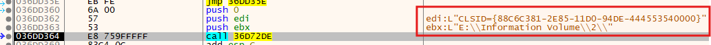
<figcaption>Decompiled code showing CLSID injection into
desktop.ini.</figcaption>
</figure>

##### Host Reconnaissance and Exfiltration

  
Following the initialization of the hidden staging directory, the
malware executes a reconnaissance routine to harvest detailed system
information from the compromised host. This process is orchestrated
through a dynamically generated batch script.

The malware constructs a temporary batch file path (e.g.,
`tmp_3970tmp.bat`) within the user’s `%TEMP%` directory. It then writes
a sequence of Windows command-line instructions into this file.

Crucially, the output filenames for these commands are not random. The
malware retrieves a unique identifier string (e.g., `3F946C3D`) directly
from its configuration data and uses it to construct the target
filenames (e.g., `3F946C3D8DDD0EBA_E.dat`). As shown previously in
Figure <a href="#fig:host_fingerprinting" data-reference-type="ref"
data-reference="fig:host_fingerprinting">2.3</a>, this identifier helps
link data to the specific infection.

Notably, the suffix appended to the filename (e.g., `_E`) corresponds
directly to the drive letter of the infected USB device. This naming
convention allows the attacker to identify the specific propagation
source for the exfiltrated data.

<figure id="fig:constructbat" data-latex-placement="H">
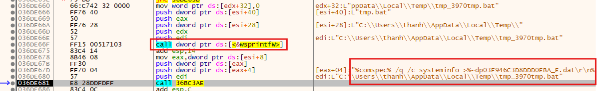
<figcaption>Code constructing the reconnaissance batch script using the
Config ID.</figcaption>
</figure>

The content of the generated batch file is as follows:

``` verilog
%comspec% /q /c ipconfig /all >>%~dp0[Config_ID]_[Suffix].dat
%comspec% /q /c netstat -ano >>%~dp0[Config_ID]_[Suffix].dat
%comspec% /q /c arp -a >>%~dp0[Config_ID]_[Suffix].dat
%comspec% /q /c tasklist -v >>%~dp0[Config_ID]_[Suffix].dat
del %0
```

- **Output Redirection:** The output of each command is redirected (or
  appended) to the uniquely named data file located in the same
  directory.

- **Self-Deletion:** The final command `del %0` ensures the batch script
  deletes itself immediately after execution to minimize forensic
  footprints.

**Execution and Collection**  
The malware executes the script using `cmd.exe`. As shown in the process
tree below, the parent malware process spawns the command processor,
which in turn launches standard Windows utilities (`systeminfo`,
`ipconfig`, etc.).

<figure id="fig:reconexecution" data-latex-placement="H">

<figcaption>Process tree capturing the execution of reconnaissance
commands.</figcaption>
</figure>

The result is a plaintext file containing comprehensive system details.

<figure id="fig:reconresult" data-latex-placement="H">
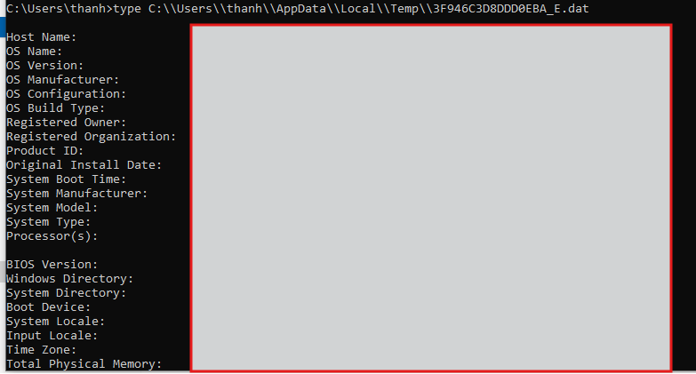
<figcaption>The raw output file containing system
information.</figcaption>
</figure>

Once the data is captured, the malware reads the plaintext result file
and encrypts its content using the `mw_xor_buffer` routine. Consistent
with the encryption logic observed in the logging module, the key is
dynamically derived from the data size.

<div class="center">

`key = length(buffer) + 1`

</div>

The encrypted data is then saved to the hidden exfiltration folder on
the USB drive.

<figure id="fig:writetousb" data-latex-placement="H">
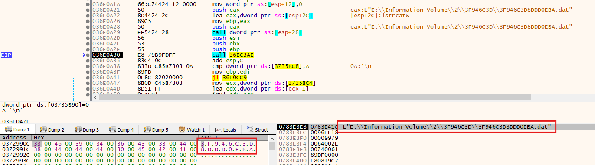
<figcaption>Writing the encrypted reconnaissance data to the hidden USB
folder.</figcaption>
</figure>

Finally, to clean up its tracks on the host, the malware deletes the
local temporary file containing the plaintext reconnaissance data.

<figure id="fig:deleterecon" data-latex-placement="H">
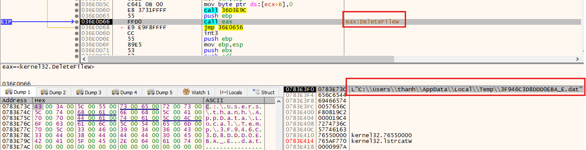
<figcaption>Debug showing the deletion of the local reconnaissance
file.</figcaption>
</figure>

##### System-Wide Targeted Exfiltration to USB

  
Once the reconnaissance data is secured, the malware begins the actual
theft of user documents. This process occurs in distinct phases, all
relying on the previously defined targeting criteria (File Type Bitmask,
Recency, and Size) to filter content.

**Phase 1: Known Directory Collection**  
The malware first targets specific, hardcoded directory paths on the
compromised host that are highly likely to contain user data. It
directly invokes the exfiltration routine `mw_import_host_files_to_usb`
against:

- `%ALLUSERSPROFILE%\Internet\` (e.g., `C:\ProgramData\Internet\`)

- `%USERPROFILE%\` (e.g., `C:\Users\[Username]\`)

<figure id="fig:targetdirs" data-latex-placement="H">
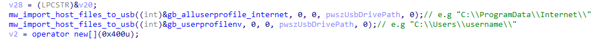
<figcaption>Targeting specific user and program data directories for
exfiltration.</figcaption>
</figure>

**Phase 2: Full Drive Enumeration**  
Following the targeted collection, the malware attempts to scour the
rest of the system. It utilizes a `do-while` loop to iterate through all
mounted volumes on the host.

For each detected volume, the malware checks the drive type. If the
drive is determined to be a fixed disk (and not the USB destination
itself), the malware initiates a recursive crawl of that drive. Any file
encountered during this scan that matches the "files of interest"
criteria is immediately copied to the hidden staging folder on the USB
drive.

<figure id="fig:driveenum" data-latex-placement="H">
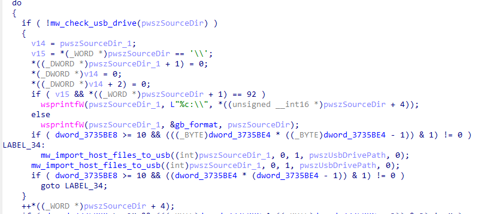
<figcaption>Looping through non-USB volumes to steal eligible
files.</figcaption>
</figure>

**Phase 3: Filename Obfuscation (Base64)**  
A distinct characteristic of the exfiltration process is the obfuscation
of filenames on the destination drive. When a file is stolen, its
original name is not preserved in plaintext. Instead, the malware
encodes the original filename using **Base64**.

As seen in the Process Monitor log below, the malware reads the source
file `doc\test.docx` and writes it to the USB drive using the filename
`ZG9jX3Rlc3QuZG9jeA==`.

<figure id="fig:procmonsteal" data-latex-placement="H">

<figcaption>ProcMon capture: Read <code>doc\test.docx</code> <span
class="math inline">→</span> Write
<code>ZG9jX3Rlc3QuZG9jeA==</code>.</figcaption>
</figure>

This results in a directory listing on the USB drive composed entirely
of Base64 strings, further obfuscating the nature of the stolen data to
a casual observer.

<figure id="fig:base64dir" data-latex-placement="H">
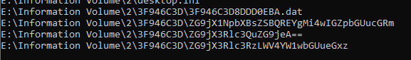
<figcaption>The exfiltration directory populated with Base64 encoded
filenames.</figcaption>
</figure>

Decoding these strings confirms the mapping to the original user files.

<figure id="fig:decodebase64" data-latex-placement="H">
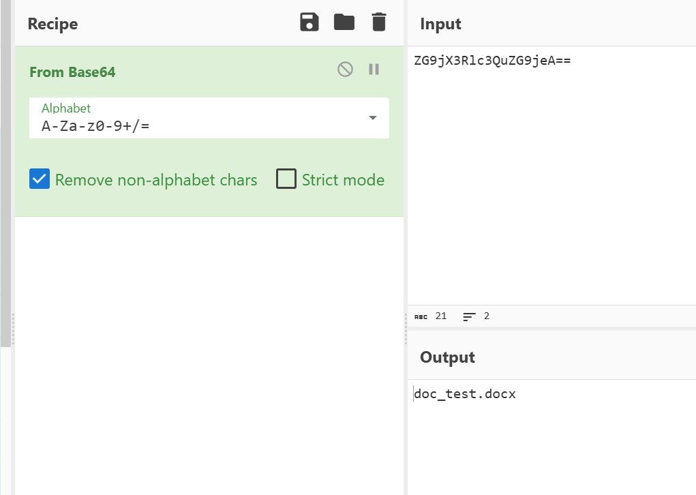
<figcaption>Decoding the artifact confirms the original
filename.</figcaption>
</figure>

#### Thread 3: Offline Batch Script Execution

The third worker thread functions as a fallback command channel. Before executing its payload logic, the thread attempts to validate an internal condition by querying the registry value:

<div class="center">

`HKCU\System\CurrentControlSet\Control\Network\proxy`

</div>

Analyst Note: This is not a standard Windows registry key for proxy configurations. It appears to be a malware-defined artifact—likely a flag set by the attacker or a previous infection stage—used to conditionally enable or disable this specific thread's execution (a custom "kill-switch"). The thread proceeds only if this value is not set to "1".

Upon passing this check, the malware scans the USB target directory
`[Drive]:\Information Volume\2\p\` for batch files (`.bat`).

**Experimental Observation:** To observe this behavior during dynamic
analysis, a test payload named `hello.bat` was manually placed in the
target directory on the simulated USB drive. The malware successfully
detected this file, triggering the execution chain.

The execution flow involves reading the batch file, decrypting it using
a dynamic XOR key (derived from the file size), and writing the content
to a randomly named file in the host’s `%TEMP%` directory. As captured
in the Process Monitor log below, the malware then executes this
temporary script.

<figure id="fig:executebat" data-latex-placement="H">
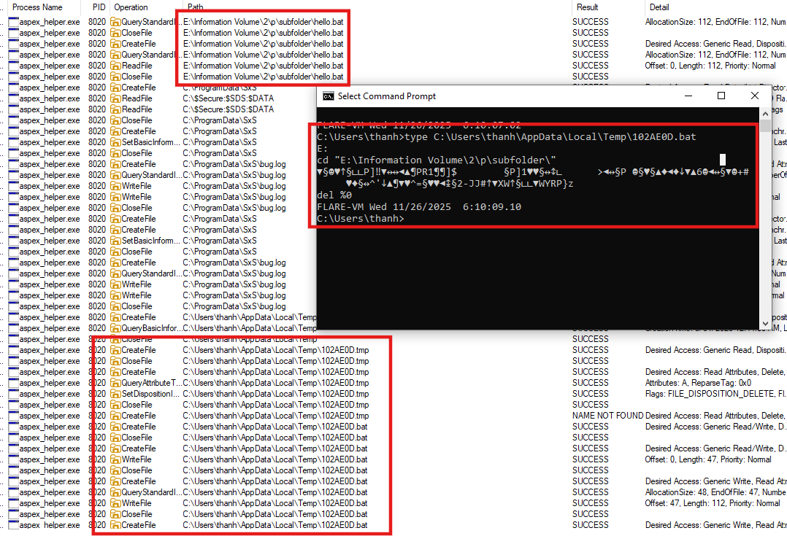
<figcaption>ProcMon log showing the creation and execution of the
temporary batch file.</figcaption>
</figure>

Following execution, the malware performs a cleanup routine, deleting
both the original file from the USB and the temporary artifact from the
host. This behavior suggests the thread is designed to execute encrypted
batch scripts dropped onto the USB during a physical access event.

#### WiFi Credential Harvesting and Connectivity Restoration

The malware implements a dedicated persistence mechanism to harvest
wireless network credentials and actively restore internet connectivity
if the compromised host goes offline. This logic is managed by a worker
thread that wakes up every 2 minutes to execute the harvesting routine.

##### Credential Staging and Theft

  
Upon execution, the malware prepares a hidden staging directory at
`%TEMP%\WiFi`. It explicitly hides this folder by setting the
`FILE_ATTRIBUTE_HIDDEN` flag.

To harvest credentials, the malware invokes the Windows `netsh` utility.
Crucially, it uses the `key=clear` argument, forcing Windows to dump the
saved WiFi passwords in plaintext within the output XML files.

    cmd.exe /c netsh wlan export profile key=clear folder="%TEMP%\WiFi"

##### Connectivity Restoration Logic

  
After exporting the profiles, the malware checks the host’s internet
connection status. If the host is offline, it iterates through the
exported XML files to find a known network that is currently within
range.

<figure id="fig:iterate_profiles" data-latex-placement="H">
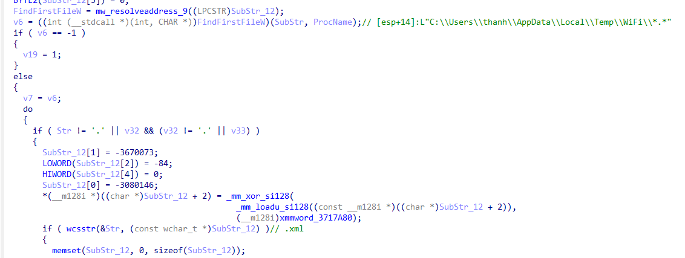
<figcaption>Logic iterating through exported profiles to attempt
reconnection.</figcaption>
</figure>

To perform this network discovery without alerting the user, the malware
creates an anonymous pipe and spawns a child process to list all
currently visible wireless networks. It uses ‘find "SSID"\` to filter
the output, ensuring it captures the names of all nearby access points.

    %comspec% /c netsh wlan show networks | find "SSID"

<figure id="fig:scan_wifi" data-latex-placement="H">
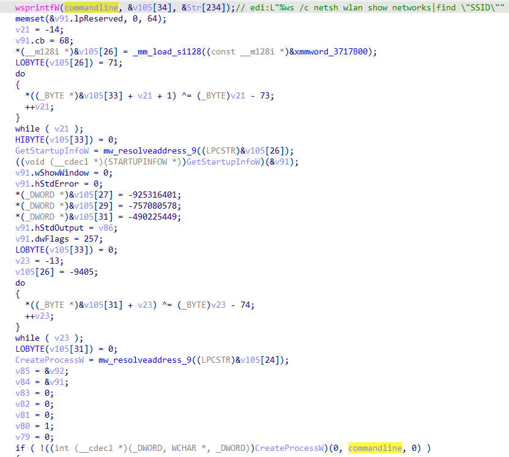
<figcaption>Executing netsh via anonymous pipes to list all visible
SSIDs.</figcaption>
</figure>

The malware reads this aggregate list from the pipe and then internally
searches the buffer (using string comparison functions like `wcsstr`) to
determine if the specific SSID from the target XML profile is present.

If the network is found, the malware executes a sequence of three
commands to forcibly reset the wireless interface and connect using the
stolen credentials:

    :: 1. Disconnect from any current access point
    %comspec% /c netsh wlan disconnect

    :: 2. Re-import the profile (restoring the plaintext key)
    %comspec% /c netsh wlan add profile filename="[Path_To_Profile.xml]"

    :: 3. Initiate the connection
    %comspec% /c netsh wlan connect name="[Profile_Name]"

#### Command and Control (C2) Communication

Following the infection and local data harvesting routines, the malware
initiates its primary Command and Control (C2) module, `mw_c2_main`.
This module is responsible for establishing a secure channel with the
attacker, receiving tasks, and exfiltrating collected data.

##### Anti-Debugging Measures

  
Upon entering the C2 routine, the malware immediately creates a
dedicated thread to protect itself from dynamic analysis. The function
`mw_c2_main` resolves the address of `CreateThread` and spawns
`mw_thread_check_debugger`.

<figure id="fig:antidebug_thread" data-latex-placement="H">
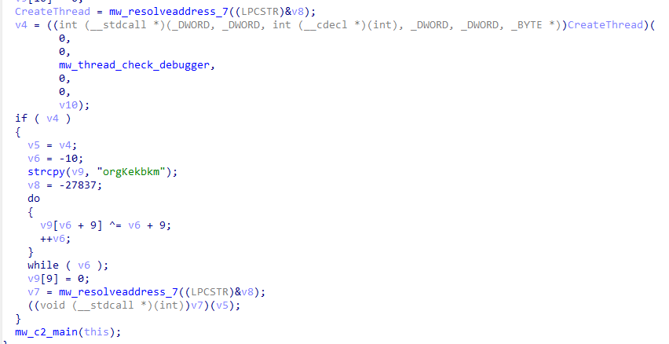
<figcaption>Creation of the anti-debugging thread prior to C2
execution.</figcaption>
</figure>

The `mw_thread_check_debugger` function executes an infinite loop that
periodically invokes the Windows API `CheckRemoteDebuggerPresent`.

- It checks if the current process is being debugged.

- If a debugger is detected (return value is 1), the thread breaks the
  loop and immediately terminates the malware process, thereby
  preventing further analysis.

- If no debugger is found, it sleeps for 1,000 milliseconds (1 second)
  before repeating the check.

<figure id="fig:check_debugger_code" data-latex-placement="H">
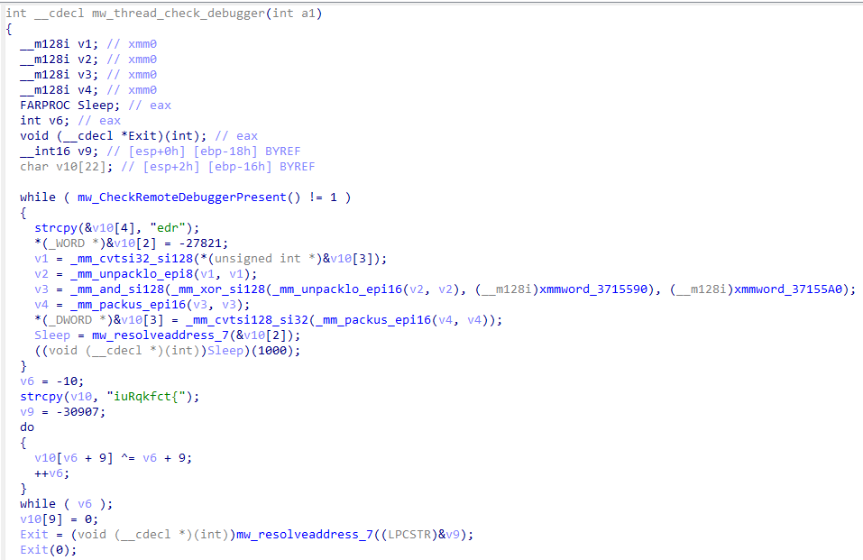
<figcaption>The dedicated thread continuously polling for
debuggers.</figcaption>
</figure>

##### Connectivity Check and Decoy Traffic

  
Before attempting to connect to its actual C2 server, the malware
performs a connectivity check that doubles as a camouflage technique. It
constructs a request to a legitimate, high-reputation domain to test
internet access and blend in with normal background traffic.

As seen in the decompiled code, the malware obfuscates the target
string. At runtime, this string resolves to `www.microsoft.com`. The
malware configures the port to **443** (HTTPS) and calls
`mw_try_to_communicate_with_server`.

<figure id="fig:decoy_microsoft" data-latex-placement="H">

<figcaption>Targeting www.microsoft.com as a decoy connectivity
check.</figcaption>
</figure>

Following the decoy check, the malware enters a loop that iterates
through each of the three C2 profiles extracted from its configuration
data, as shown previously in
Figure <a href="#fig:c2_config_addresses" data-reference-type="ref"
data-reference="fig:c2_config_addresses">2.2</a>. For each profile, it
attempts to establish a connection to the specified server using the  
`mw_try_to_communicate_with_server` function.

<figure id="fig:c2_profile_loop" data-latex-placement="H">
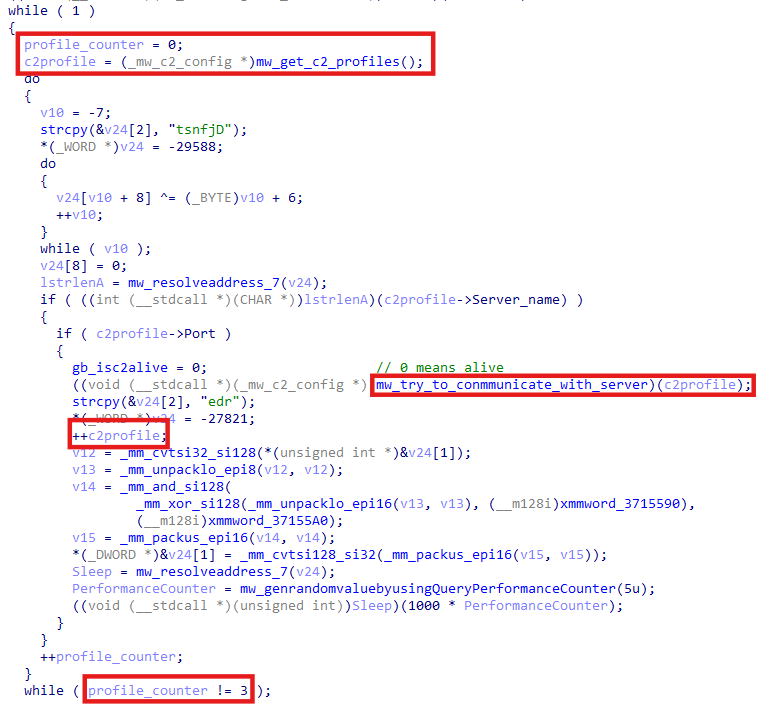
<figcaption>Looping through the 3 C2 profiles and attempting
connection.</figcaption>
</figure>

The communication wrapper, `mw_try_to_communicate_with_server`, enters a
persistent `while(1)` loop to initiate the connection via
`mw_start_communication`.

The loop logic is governed by the return value of
`mw_start_communication`. Since this function blocks during an active
session, a return value implies the session has ended.

The malware handles the reconnection logic as follows:

1.  **Error Tracking:** If the connection attempt fails (result is
    non-zero), the malware increments an internal error counter located
    at `this[3]`.

2.  **Threshold Check:** The code immediately checks if this counter has
    reached **3**. If so, it explicitly terminates the loop (`break`) to
    abandon the current C2 profile.

3.  **Global Termination Check:** Regardless of the error counter, the
    malware checks the global state variable `gb_isc2alive`.

    - If this value equals **4**, the function returns the error code
      immediately, effectively aborting all communication attempts.

4.  **Retry Delay:** If neither termination condition is met (and an
    error occurred), the malware sleeps for 2,000 milliseconds (2
    seconds) before re-attempting the connection.

<figure id="fig:communication_loop" data-latex-placement="H">
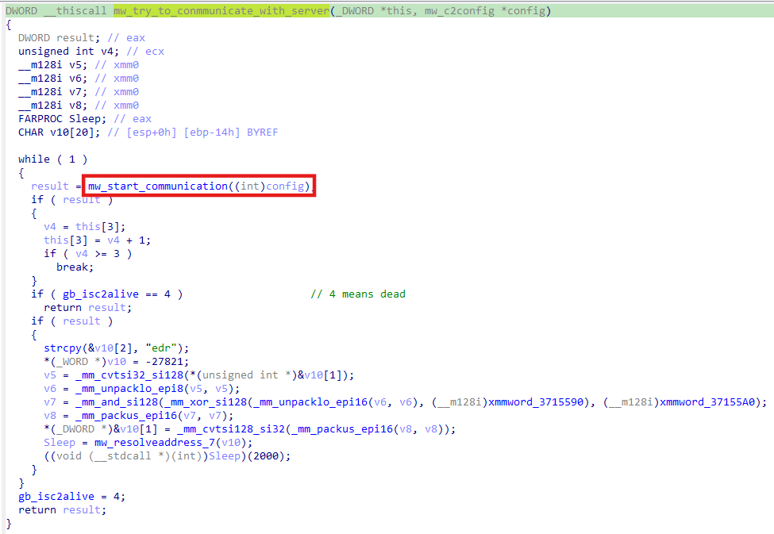
<figcaption>Loop attempting to establish connection.</figcaption>
</figure>

##### Session Initialization and Environment Fingerprinting

  
The function `mw_start_communication` is responsible for configuring the
HTTP session. This involves two critical steps: masquerading as a
legitimate browser via a custom User-Agent and adhering to the victim’s
proxy settings.

<figure id="fig:start_comm_init" data-latex-placement="H">
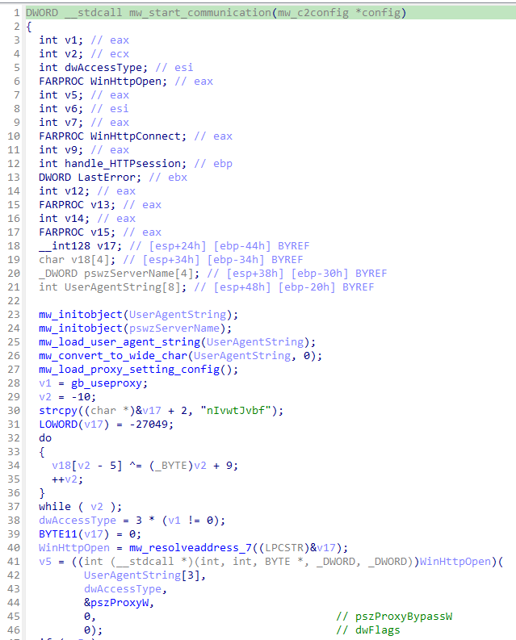
<figcaption>Initialization of User-Agent and Proxy settings before
WinHttpOpen.</figcaption>
</figure>

##### Dynamic User-Agent Generation

  
To evade network-based signatures that flag generic or hardcoded
User-Agent strings, the malware dynamically constructs a string that
mimics Internet Explorer running on the specific victim host. The format
used is:

<div class="center">

`Mozilla/5.0 (compatible; MSIE {1}; Windows NT {2}.{3}; {4}; {5}; {6}; {7})`

</div>

The placeholders `{1}` through `{7}` are populated by querying specific
Windows Registry keys to gather system information:

<span id="tab:user_agent_placeholders"
label="tab:user_agent_placeholders"></span>

<div id="tab:user_agent_placeholders">

<table>
<caption>Dynamic User-Agent Placeholder Mapping</caption>
<thead>
<tr>
<th style="text-align: center;"><strong>ID</strong></th>
<th style="text-align: left;"><strong>Data Source / Registry
Key</strong></th>
</tr>
</thead>
<tbody>
<tr>
<td style="text-align: center;">{1}</td>
<td style="text-align: left;"><strong>IE Version</strong><br />
Derived from:<br /> HKEY\_LOCAL\_MACHINE\SOFTWARE\Microsoft\Internet Explorer\Version Vector\IE
<br />
(Defaults to ’8.00’ if not found).</td>
</tr>
<tr>
<td style="text-align: center;">{2}</td>
<td style="text-align: left;"><strong>OS Major Version</strong> of the
host.</td>
</tr>
<tr>
<td style="text-align: center;">{3}</td>
<td style="text-align: left;"><strong>OS Minor Version</strong> of the
host.</td>
</tr>
<tr>
<td style="text-align: center;">{4}</td>
<td style="text-align: left;"><strong>System Post Platform
(5.0)</strong><br />
Concatenated values from: HKEY_LOCAL_MACHINE\SOFTWARE\Microsoft\Windows\CurrentVersion\InternetSe
ttings\5.0\UserAgent\PostPlatform<br />
</td>
</tr>
<tr>
<td style="text-align: center;">{5}</td>
<td style="text-align: left;"><strong>Machine Post
Platform</strong><br />
Concatenated values from: HKEY_LOCAL_MACHINE\SOFTWARE\Microsoft\Windows\CurrentVersion\InternetSe
ttings\UserAgent\PostPlatform<br />
</td>
</tr>
<tr>
<td style="text-align: center;">{6}</td>
<td style="text-align: left;"><strong>User Post Platform
(5.0)</strong><br />
Concatenated values from: HKEY_CURRENT_USER\Software\Microsoft\Windows\CurrentVersion\InternetSettings
\5.0\UserAgent\PostPlatform<br />
</td>
</tr>
<tr>
<td style="text-align: center;">{7}</td>
<td style="text-align: left;"><strong>User Post Platform</strong><br />
Concatenated values from: HKEY_CURRENT_USER\Software\Microsoft\Windows\CurrentVersion\InternetSettings
\UserAgent\PostPlatform<br />
</td>
</tr>
</tbody>
</table>

</div>

##### Proxy Configuration

  
To ensure the malware can communicate even in corporate environments
protected by proxy servers, it executes `mw_load_proxy_setting_config`.
This function queries the Windows Registry at:

`HKEY_CURRENT_USER\Software\Microsoft\Windows\CurrentVersion\Internet Settings`

It specifically checks two values:

- **ProxyEnable:** Checked to determine if a proxy is currently active
  (`1` = active).

- **ProxyServer:** Read to retrieve the actual proxy address and port.

These gathered settings—the custom User-Agent string and the Proxy
configuration—are passed to the `WinHttpOpen` API, initializing the
session that will be used for the subsequent C2 traffic.

<figure id="fig:c2_connection_loop" data-latex-placement="H">
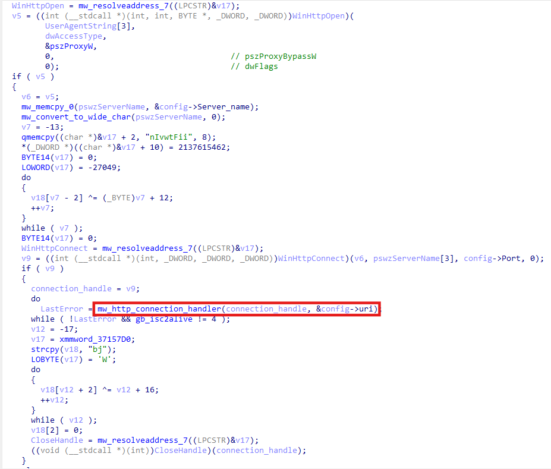
<figcaption>The C2 communication loop invoking the HTTP connection
handler.</figcaption>
</figure>

##### Initial Handshake and Key Retrieval

  
Upon establishing a connection to the C2 server, the execution flow
enters the  
`mw_http_connection_handler`. The primary objective of this phase is to
perform an initial handshake to retrieve a session-specific encryption
key from the server.

The handler first constructs an obfuscated string which resolves to the
HTTP verb **"GET"**. It then invokes the function `mw_retrieve_key`,
passing the session handle and the URI.

<figure id="fig:retrieve_key_call" data-latex-placement="H">
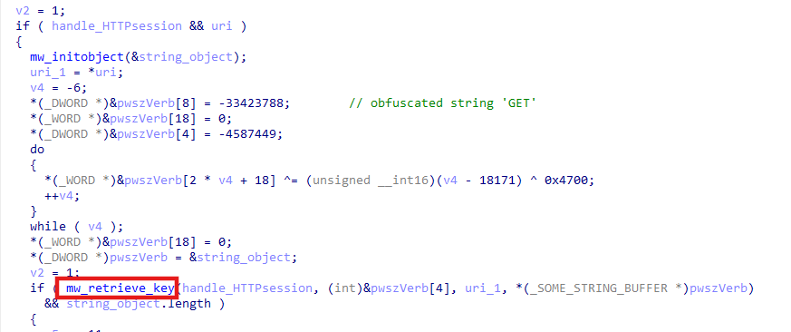
<figcaption>The handler invoking <code>mw_retrieve_key</code> using a
GET request.</figcaption>
</figure>

##### Transition to Main C2 Loop

  
If the GET request is successful and the server responds with valid
data, the function returns a non-zero length for the retrieved string
object. This response contains the encryption key required for
subsequent communications.

The malware allocates memory for this key and stores it for later use.
Once the key is secured, the protocol switches the HTTP verb to
**"POST"** and calls `mw_c2handle`. This function represents the main
Command and Control routine, where the malware begins its check-in loop
and task processing.

<figure id="fig:key_success_c2handle" data-latex-placement="H">
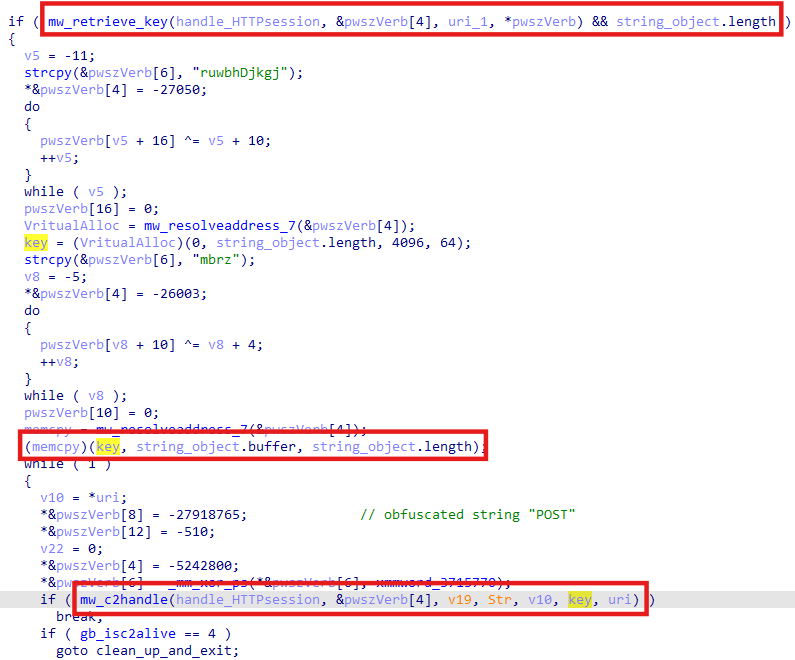
<figcaption>Successful key retrieval leading to the execution of
<code>mw_c2handle</code>.</figcaption>
</figure>

##### Custom Header Construction (X-Oss-Request-Id)

  
Inside the `mw_retrieve_key` function, the malware constructs a specific
custom HTTP header to embed in the request. This header,
`X-Oss-Request-Id`.

The header value follows the format `%2.2X%ws` and is generated using
two specific routines:

1.  **Random ID Generation:** The malware calls
    `mw_generate_random_number`, which utilizes the high-resolution
    timer `QueryPerformanceCounter` to generate a seed. It adds **100**
    to this value to ensure a specific numeric range.

2.  **Checksum-Based String:** It calls `mw_GenerateStringFromChecksum`
    with the argument **99**. This function generates a random
    alphanumeric string that mathematically satisfies a specific
    checksum algorithm, serving as a validity check for the server.

These components are formatted into the header string using `wsprintfW`
before the request is dispatched.

<figure id="fig:header_construction" data-latex-placement="H">
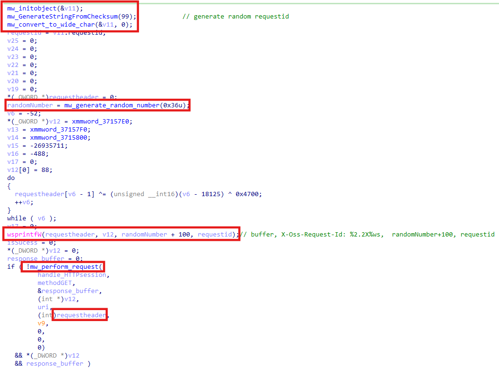
<figcaption>Construction of the <code>X-Oss-Request-Id</code> header
using dynamic values.</figcaption>
</figure>

The malware then passes this constructed header to `mw_perform_request`
to transmit the packet to the C2 server.

It is important to note that the checksum argument passed to
`mw_GenerateStringFromChecksum` serves as a specific indicator of the
request type to the C2 server.

- **GET Requests (Key Retrieval):** As described in the key retrieval
  routine above, the malware uses the argument **99** to generate the
  validation string.

- **POST Requests (Data Transmission):** For subsequent POST requests
  used to upload data or receive tasks, the malware switches the
  argument to **88**.

This differentiation likely allows the server to quickly categorize
incoming traffic based solely on the algorithmic properties of the
`X-Oss-Request-Id` header.

<figure id="fig:post_header_checksum" data-latex-placement="H">
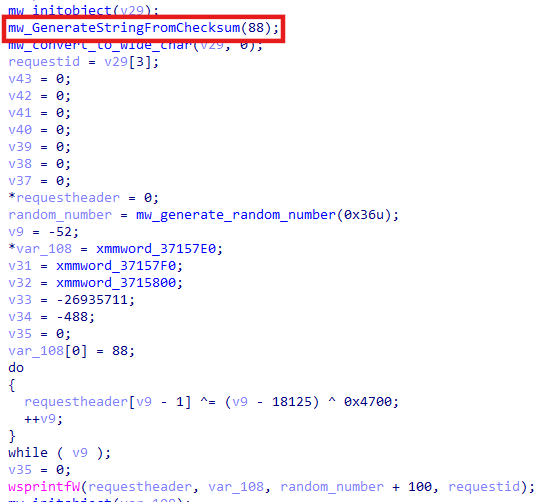
<figcaption>Generation of the X-Oss-Request-Id header for POST requests
using checksum 88.</figcaption>
</figure>

##### Request Initialization

  
The malware initiates the request using `WinHttpOpenRequest`. Notably,
the code explicitly passes `0` (NULL) for both the `pwszObjectName`
(Object Name) and `pwszVersion` (HTTP Version) parameters.

By default, this forces the API to request the root path using HTTP/1.1.
Consequently, all C2 traffic generated by this malware will appear on
the wire with the following request lines, regardless of the specific C2
server file structure:

<div class="center">

`GET / HTTP/1.1` or `POST / HTTP/1.1`

</div>

<figure id="fig:winhttp_request" data-latex-placement="H">
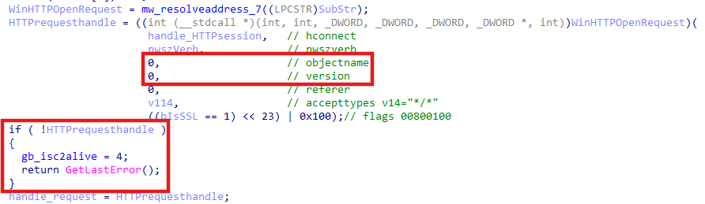
<figcaption>WinHttpOpenRequest called with NULL parameters, resulting in
generic request paths.</figcaption>
</figure>

##### Timeout Configuration

  
To ensure connection stability, particularly when operating on slow or
unstable networks, the malware overrides the default Windows HTTP
timeouts. It retrieves a configuration value stored in the global
variable `gb_timeout_settings` (extracted earlier from the config data)
and applies it to the session.

In the analyzed sample, these timeouts are set to **60,000 ms (60
seconds)** for the following operations:

- `WINHTTP_OPTION_CONNECT_TIMEOUT`

- `WINHTTP_OPTION_RECEIVE_TIMEOUT`

- `WINHTTP_OPTION_SEND_TIMEOUT`

<figure id="fig:http_timeouts" data-latex-placement="H">
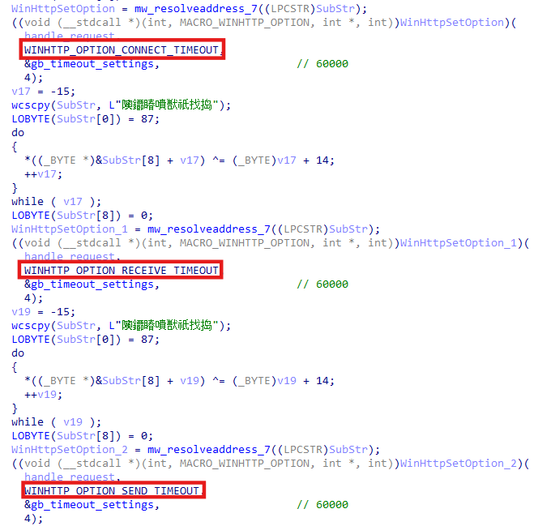
<figcaption>Setting connection, receive, and send timeouts to 60
seconds.</figcaption>
</figure>

##### SSL/TLS Security Configuration

  
The malware communicates with its C2 server over HTTPS. Recognizing that
the attacker infrastructure often utilizes self-signed or otherwise
invalid SSL certificates, the malware explicitly relaxes standard
security checks to prevent connection errors.

If SSL is enabled, the code applies the flag `0x3300` using
`WinHttpSetOption`. This value corresponds to a bitwise combination of
flags that instruct the client to ignore specific certificate errors:

- `WINHTTP_FLAG_IGNORE_UNKNOWN_CA`

- `WINHTTP_FLAG_IGNORE_CERT_CN_INVALID` (Hostname mismatch)

- `WINHTTP_FLAG_IGNORE_CERT_DATE_INVALID` (Expired certificate)

<figure id="fig:ssl_config" data-latex-placement="H">
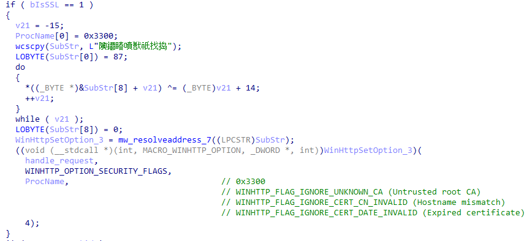
<figcaption>Applying security flags (0x3300) to ignore SSL certificate
errors.</figcaption>
</figure>

##### Custom Header Injection (X-Cache)

  
Finally, the malware injects a custom HTTP header named `X-Cache` into
every request. This header serves as a secondary authentication
mechanism and transmits the victim’s unique identity to the C2 server.

The header value is dynamically constructed using the format:

<div class="center">

`X-Cache: {Rand1}{Rand2}{VictimID}`

</div>

- **{Rand1} & {Rand2}:** Two randomly generated hex strings (2
  characters each).

- **{VictimID}:** The persistent 16-character unique identifier
  generated during the Host Fingerprinting phase (refer to Figure
  <a href="#fig:host_fingerprinting" data-reference-type="ref"
  data-reference="fig:host_fingerprinting">2.3</a> and the variable
  `gb_victim_id`).

<figure id="fig:xcache_header" data-latex-placement="H">
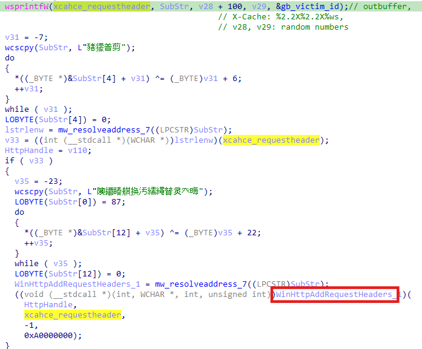
<figcaption>Construction of the custom X-Cache header embedding the
Victim ID.</figcaption>
</figure>

##### Response Header Validation and Processing

  
Upon receiving a response from the C2 server, the malware does not
immediately process the payload. Instead, it performs a strict
validation of the HTTP headers to ensure the response is legitimate and
intended for this specific implant.

The malware first queries the `Content-Type` header using
`WinHttpQueryHeaders` with the flag `WINHTTP_QUERY_CONTENT_TYPE`.

It strictly validates that this value matches the string
`"application/octet-stream"`. As seen in the decompiled logic, the code
uses `lstrcmpiW` to compare the retrieved header against this hardcoded
string.

- **Match:** If the strings match (return value 0), execution proceeds.

- **Mismatch:** If the Content-Type is anything else (e.g.,
  `text/html`), the code immediately jumps to the cleanup routine and
  aborts the connection.

<figure id="fig:query_content_type" data-latex-placement="H">
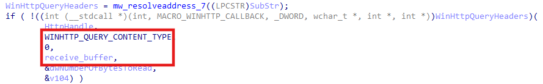
<figcaption>Querying the Content-Type header from the server
response.</figcaption>
</figure>

<figure id="fig:validate_content_type" data-latex-placement="H">
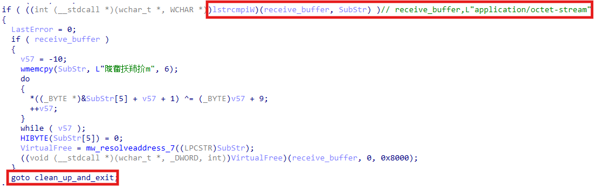
<figcaption>Enforcing that the Content-Type must be
"application/octet-stream".</figcaption>
</figure>

When the C2 server intends to deliver a file (e.g., a plugin or update),
it includes a custom `filename` parameter within the HTTP headers. To
retrieve this, the malware cannot use a standard flag; instead, it
requests the entire header block using `WINHTTP_QUERY_RAW_HEADERS_CRLF`.

This API call returns all returned headers as a single string. The
malware then parses this raw data to locate the `"filename"` directive
and extract the target file name.

<figure id="fig:query_raw_headers" data-latex-placement="H">
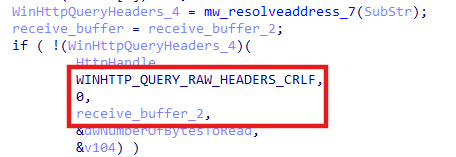
<figcaption>Retrieving the full raw headers to parse the custom
"filename" parameter.</figcaption>
</figure>

##### Packet Structure

  
The malware constructs a header containing metadata, followed by the
victim’s identification string, and finally the actual payload data.
Based on the analysis of the underlying structure, the packet format is
defined as follows:

<div id="tab:packet_structure">

| **Offset** | **Size** | **Description** |
|:---|:---|:---|
| 0x00 | 2 bytes | **Transaction ID**: A random value generated to uniquely identify the request and prevent replay attacks. |
| 0x02 | 2 bytes | **Command ID**: Indicates the type of data or operation being conveyed in the packet. |
| 0x04 | 4 bytes | **Payload Size**: The total size of the data section that follows the header. |
| 0x08 | 8 bytes | **Reserved**: Padding fields initialized to zero. |
| 0x10 | 32 bytes | **Beacon ID**: The unique fingerprint of the compromised host. |
| 0x30 | Variable | **Data Payload**: The actual operational data, which varies depending on the mode. |

C2 Packet Structure (Pre-Encryption)

</div>

##### Payload Selection Logic

  
The packet construction logic operates in one of two distinct modes,
dictating the content of the Data Payload section:

- **Heartbeat Mode:** In this mode, the malware initiates an internal
  routine to aggregate comprehensive system and session details. As
  confirmed by the code analysis
  (Figure <a href="#fig:gather_info" data-reference-type="ref"
  data-reference="fig:gather_info">2.76</a>), this includes the
  Operating System version, CPU architecture (specifically checking for
  WOW64 execution), the current User Name and Computer Name, the name of
  the executing process, the malware’s internal version string, and a
  list of local IP addresses. This fingerprinting data is formatted into
  a payload buffer to provide the C2 server with a detailed status
  update.

- **Task Response Mode:** This mode is used when the malware needs to
  return data resulting from a specific task (e.g., the output of a
  shell command, a file listing, or exfiltrated data). The routine takes
  a raw data buffer containing these results and wraps it as the
  payload.

<figure id="fig:gather_info" data-latex-placement="H">
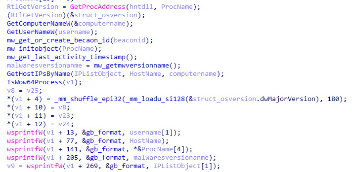
<figcaption>Decompiled routine showing the aggregation of system
information in heartbeat mode.</figcaption>
</figure>

##### Packet Encryption

  
After constructing the full buffer—comprising the header, the Beacon ID,
and the selected payload data—the malware calculates the total plaintext
size. It then allocates a new memory region and invokes the RC4
encryption routine.

Crucially, the **entire packet structure** is encrypted using the
session-specific RC4 key retrieved during the initial handshake. This
ensures that all fields, including the packet headers and the victim’s
identity, are completely obfuscated from network inspection.

#### Command Dispatching and Task Execution

Upon successfully checking in with the C2 server (via a POST request),
the malware receives an encrypted response. It decrypts this response
buffer using the session RC4 key.

<figure id="fig:c2_command_dispatch" data-latex-placement="H">
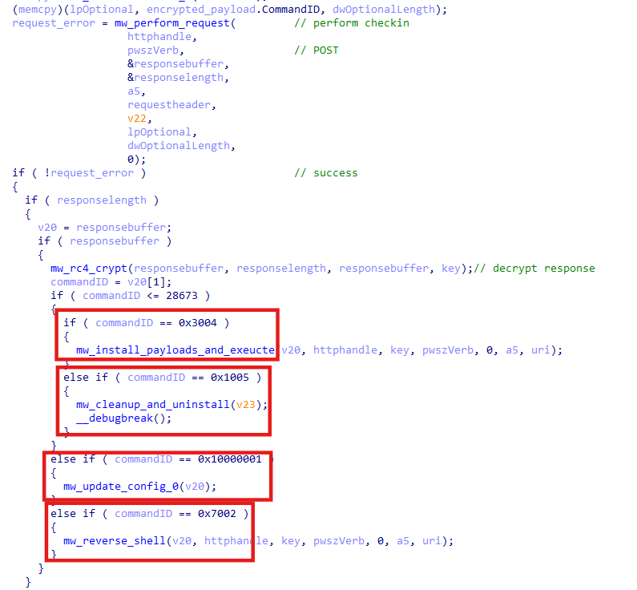
<figcaption>Decompiled switch logic handling the parsed Command
IDs.</figcaption>
</figure>

The decrypted packet follows a specific structure where the second
4-byte integer (at index `v20[1]`) represents the **Command ID**. The
malware parses this ID to determine which malicious task to execute.
Based on the analysis of the dispatch loop
(Figure <a href="#fig:c2_command_dispatch" data-reference-type="ref"
data-reference="fig:c2_command_dispatch">2.77</a>), the malware supports
the following primary commands:

<span id="tab:c2_commands" label="tab:c2_commands"></span>

<div id="tab:c2_commands">

<table>
<caption>Supported C2 Command IDs and Functionality</caption>
<thead>
<tr>
<th style="text-align: left;"><strong>Command ID (Hex)</strong></th>
<th style="text-align: left;"><strong>Command ID (Decimal)</strong></th>
<th style="text-align: left;"><strong>Task Description</strong></th>
</tr>
</thead>
<tbody>
<tr>
<td style="text-align: left;"><code>0x3004</code></td>
<td style="text-align: left;">12292</td>
<td style="text-align: left;"><strong>Payload Installation &amp;
Execution</strong><br />
Downloads additional malicious components (typically dropped files) to
the host, installs them, and executes the payload.</td>
</tr>
<tr>
<td style="text-align: left;"><code>0x3004</code></td>
<td style="text-align: left;">12292</td>
<td style="text-align: left;"><strong>Download and Execute
Payload</strong><br />
Initiates a routine to download three specific components (EXE, DLL, and
DAT) from the C2 server. Once saved, it executes the signed binary to
trigger the new payload via DLL side-loading, effectively updating the
malware or loading a new module.</td>
</tr>
<tr>
<td style="text-align: left;"><code>0x10000001</code></td>
<td style="text-align: left;">268435457</td>
<td style="text-align: left;"><strong>Update
Configuration</strong><br />
Updates the internal configuration of the malware (e.g., C2 addresses,
sleep timers) with new data provided by the server.</td>
</tr>
<tr>
<td style="text-align: left;"><code>0x7002</code></td>
<td style="text-align: left;">28674</td>
<td style="text-align: left;"><strong>Reverse Shell</strong><br />
Initiates a remote shell session, allowing the attacker to execute
arbitrary commands on the victim machine.</td>
</tr>
</tbody>
</table>

</div>

##### Command 0x3004: Download and Execute Payload

  
When the Command ID `0x3004` is received, the malware initiates a
routine to fetch and execute a new payload. This mechanism is typically
used to update the malware agent or install additional modules.

The routine calls the internal function `mw_download_file_from_server`
three consecutive times. Based on the arguments passed (flags 1, 2, and
3), it attempts to download the complete PlugX loading triad:

1.  **Executable (Flag 1):** A signed, legitimate executable (the
    Loader).

2.  **DLL (Flag 2):** The malicious library to be side-loaded.

3.  **Data File (Flag 3):** The encrypted shellcode payload.

The routine maintains a success counter. Only if all three downloads
complete successfully (counter equals 3) does the execution flow
proceed.

Once the files are successfully written to disk, the malware resolves
the path to the downloaded executable. It then invokes
`mw_CreateProcess_wrapper` to launch the new process. This triggers the
side-loading chain of the new payload, effectively handing over control
to the updated version or new module.

<figure id="fig:download_exec" data-latex-placement="H">
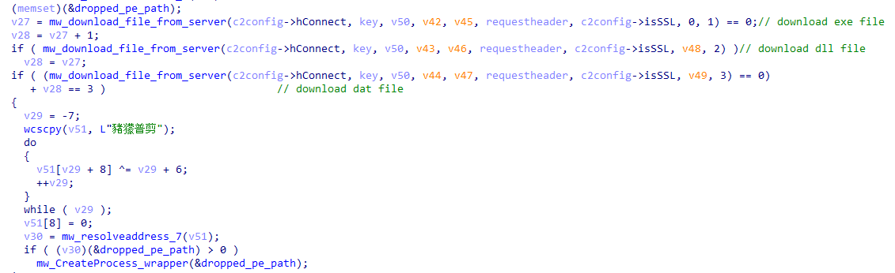
<figcaption>Decompiled logic showing the download of 3 distinct files
followed by process creation.</figcaption>
</figure>

##### Command 0x1005: Self-Destruct and Cleanup

  
When the malware receives the command ID `0x1005`, it initiates a
self-destruct sequence to remove all traces of the infection from the
host system.

First, the malware targets its persistence mechanisms. It attempts to
open the standard Windows "Run" keys in both the System and User
registry hives and deletes the value named `"Aspex Update"`:

- `HKLM\Software\Microsoft\Windows\CurrentVersion\Run\Aspex Update`

- `HKCU\Software\Microsoft\Windows\CurrentVersion\Run\Aspex Update`

<figure id="fig:cleanup_log" data-latex-placement="H">
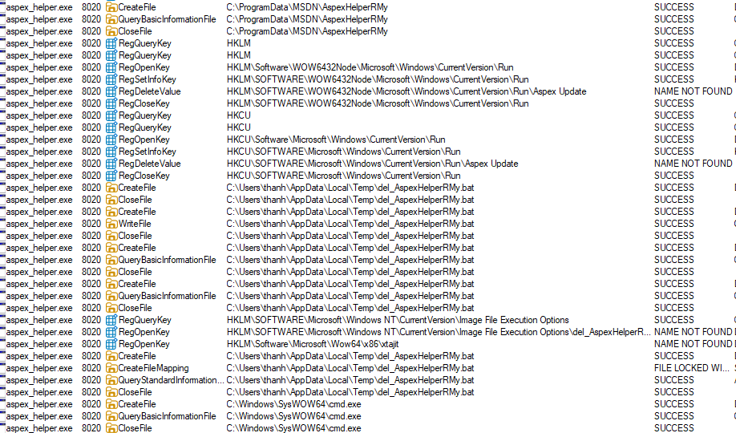
<figcaption>ProcMon log showing the deletion of registry run keys and
creation of the cleanup script.</figcaption>
</figure>

To delete its executable files while they are potentially still in use,
the malware drops a temporary batch script named
`del_AspexHelperRMy.bat` into the `%TEMP%` directory.

The content of this script is hardcoded to perform a delayed deletion:

``` verilog
ping 127.0.0.1 -n 5 >nul 2 >nul  :: Delay execution to allow main process to exit
C:
cd C:\ProgramData\MSDN\AspexHelperRMy\
del *.* /f /s /q /a              :: Force delete all files
cd ..
rd /q /s C:\ProgramData\MSDN\AspexHelperRMy\ :: Remove the directory
del %0                           :: Delete the batch script itself
```

Finally, the malware executes this script using `cmd.exe` and
immediately terminates its own process. The `ping` command in the script
acts as a sleep timer, ensuring the malware process has fully exited and
released its file locks before the deletion commands attempt to remove
the binaries.

<figure id="fig:run_del_bat" data-latex-placement="H">
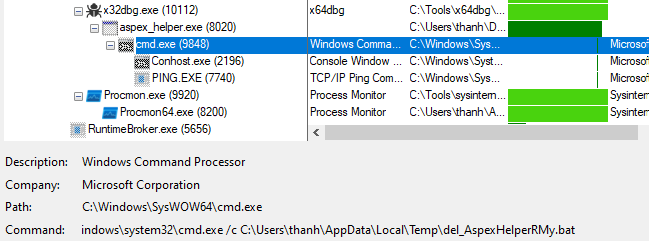
<figcaption>Execution of the deletion script via cmd.exe.</figcaption>
</figure>

##### Command 0x10000001: Update Configuration

  
When the malware receives the Command ID `0x10000001`, it triggers a
routine to modify its runtime configuration parameters. The payload
associated with this command is expected to be a comma-separated string
(CSV).

The routine parses the received string using the delimiter `","`. It
iterates through the tokens and converts them from string to integer
using `atoi`, updating the following global variables in order:

1.  **Token 1 (Index 0):** Updates `gb_jitter`. This value represents
    the sleep duration or "jitter" interval the malware waits between
    consecutive C2 check-ins, introducing randomness to evade traffic
    analysis.

2.  **Token 2 (Index 1):** Updates `gb_timeout_settings`. This value
    controls the connection, receive, and send timeouts for HTTP
    transactions, as previously detailed in the connection configuration
    section (see
    Figure <a href="#fig:http_timeouts" data-reference-type="ref"
    data-reference="fig:http_timeouts">2.70</a>).

<figure id="fig:config_update" data-latex-placement="H">
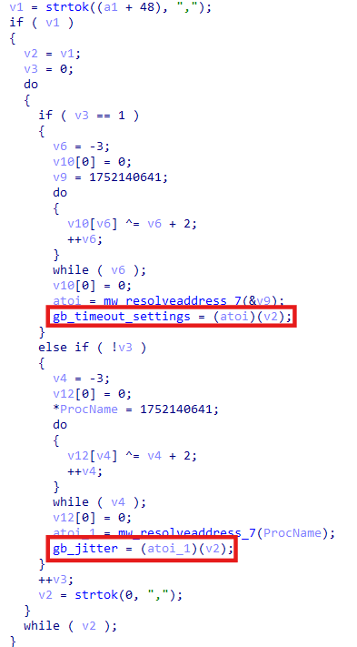
<figcaption>Decompiled logic showing the parsing of configuration
updates via strtok.</figcaption>
</figure>

##### Command 0x7002: Reverse Shell

When the Command ID `0x7002` is received, the malware executes
`mw_reverse_shell`. This function establishes a fully interactive remote
command shell, allowing the attacker to execute arbitrary Windows
commands and receive their output in real-time.

To achieve interactivity without writing to disk, the malware employs a
classic anonymous pipe architecture coupled with multi-threading. The
setup process is as follows:

1.  **Pipe Creation:** The malware creates two anonymous pipes using
    `CreatePipe`:

    - **Pipe 1 (Output Pipe):** Captures `stdout` and `stderr` from the
      command processor.

    - **Pipe 2 (Input Pipe):** Feeds commands from the malware into the
      `stdin` of the command processor.

2.  **Process Spawning:** It spawns an instance of `cmd.exe` with the
    `STARTF_USESTDHANDLES` flag, explicitly redirecting the process’s
    standard input/output streams to the handles of the created pipes.

3.  **Thread Management:** Two dedicated worker threads are created to
    bridge the gap between the C2 server and the local command
    processor:

    - **Thread 1 (Command Fetcher):** Continuously sends POST requests
      to the C2 server to retrieve pending shell commands. When a
      command is received, it writes the data into **Pipe 2**,
      effectively "typing" it into the `cmd.exe` console.

    - **Thread 2 (Result Uploader):** Continuously reads the execution
      results from **Pipe 1**. It packages this output and transmits it
      back to the C2 server via a separate POST request.

This architecture creates a full-duplex communication channel, as
illustrated in the diagram below.

<figure id="fig:reverse_shell_flow_improved" data-latex-placement="H">
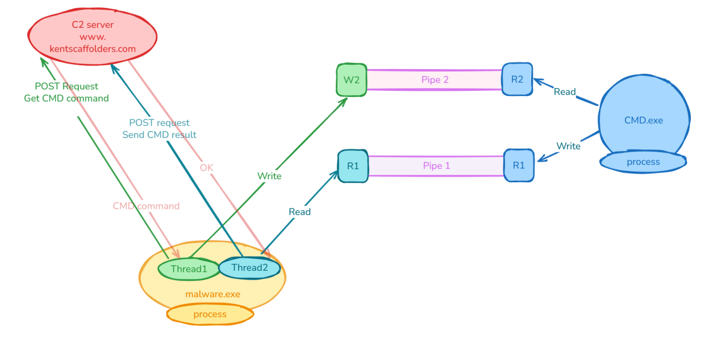
<figcaption>Architectural data flow of the multi-threaded reverse shell
module.</figcaption>
</figure>

# Indicators of Compromise

The following sections outline the technical artifacts identified during
the analysis of the AspexHelperRMy (PlugX Variant) sample. These
indicators can be used for detection, hunting, and blocking within
security environments.

## Malicious File Artifacts and Hashes

<table>
<caption>Malicious File Artifacts and Hashes</caption>
<thead>
<tr>
<th style="text-align: left;"><strong>Description</strong></th>
<th style="text-align: left;"><strong>Details</strong></th>
</tr>
</thead>
<tbody>
<tr>
<td style="text-align: left;"><strong>Loader (Signed)</strong></td>
<td style="text-align: left;"><strong>Filename:</strong>
aspex_helper.exe<br />
<strong>SHA256: ff2ba3ae5fb195918ffaa542055e800ffb34815645d39377561a3abdfdea2239</strong></td>
</tr>
<tr>
<td style="text-align: left;"><strong>Encrypted Payload</strong></td>
<td style="text-align: left;"><strong>Filename:</strong>
aspex_log.dat<br />
<strong>SHA256: bc8091166abc1f792b895e95bf377adc542828eac934108250391dabf3f57df9</strong></td>
</tr>
<tr>
<td style="text-align: left;"><strong>Side-Loaded DLL</strong></td>
<td style="text-align: left;"><strong>Filename:</strong>
RBGUIFramework.dll<br />
<strong>SHA256: 9f57f0df4e047b126b40f88fdbfdba7ced9c30ad512bfcd1c163ae28815530a6</strong></td>
</tr>
</tbody>
</table>

## Host-Based Artifacts

### FileSystem Paths

The malware utilizes specific directories for installation, data
staging, error logging, and temporary execution.

- **Primary Installation Directory:**  
  `%ALLUSERSPROFILE%\MSDN\AspexHelperRMy\`

- **Secondary Installation Directory (User):**  
  `%USERPROFILE%\AspexHelperRMy\`

- **Data Exfiltration Staging:**  
  `%AppData%\Roaming\Document\`

- **WiFi Credential Staging:**  
  `%TEMP%\WiFi\`

- **Error Logging:**  
  `%ALLUSERSPROFILE%\SxS\bug.log`

- **Transient Reconnaissance Data:**  
  `%TEMP%\[VictimID]_[USB_Drive].dat` (e.g.,
  `...3F946C3D8DDD0EBA_E.dat`)

- **Temporary Batch Execution:**  
  `%TEMP%\[Rand].bat` (e.g., `102AE0D.bat`)

### Abused System Binaries

The malware leverages legitimate Windows system executables to bypass
security controls and mask its activity.

| **Binary / Command** | **Path / Utility** | **Malicious Usage** |
|:---|:---|:---|
| **fodhelper.exe** | `%windir%\system32\fodhelper.exe` | **UAC Bypass:** Executed to auto-elevate privileges via the hijacked registry key `ms-settings\CurVer` |
| **dllhost.exe** | `%windir%\system32\dllhost.exe` | **Process Injection:** Spawned in a suspended state to host the injected PlugX payload (`Argc` = 4). |
| **netsh wlan** | `%windir%\system32\netsh.exe` | **Credential Theft & Connectivity:** Used to harvest plaintext Wi-Fi profiles and restore network access |

Legitimate System Binaries and Commands Abused

### Specific Command Line Arguments

The following blocks capture the full command-line arguments used by the
malware for persistence and network manipulation.

#### Scheduled Task Commands

```
SCHTASKS.exe /run /tn "AspexUpdateTask"

SCHTASKS.exe /create /sc minute /mo 30 /tn "AspexUpdateTask" /tr "\"\"\"C:\ProgramData\MSDN\AspexHelperRMy\aspex_helper.exe\"\"\" Rand1 Rand2 Rand3" /f

SCHTASKS.exe /create /sc minute /mo 30 /tn "AspexUpdateTask" /tr "\"\"\"C:\ProgramData\MSDN\AspexHelperRMy\aspex_helper.exe\"\"\" Rand1 Rand2 Rand3" /ru "SYSTEM" /f
```

#### WiFi Credential and Connectivity Commands

```
rem Command to export all Wi-Fi profiles in plaintext (key=clear)
%comspec% /c netsh wlan export profile key=clear folder="%TEMP%\WiFi"

rem Command to scan for nearby SSIDs (used for connection validation)
%comspec% /c netsh wlan show networks | find "SSID"

rem Commands to forcibly restore connectivity: 
%comspec% /c netsh wlan disconnect
%comspec% /c netsh wlan add profile filename="[Path_To_Profile.xml]"
%comspec% /c netsh wlan connect name="[SSID]"
```

## Registry Artifacts

## Registry Artifacts

<table>
<caption>Registry Keys and Values modified by the malware</caption>
<thead>
<tr>
<th style="text-align: left;"><strong>Category</strong></th>
<th style="text-align: left;"><strong>Key / Value /
Purpose</strong></th>
</tr>
</thead>
<tbody>
<tr>
<td style="text-align: left;"><strong>Victim Fingerprint</strong></td>
<td style="text-align: left;"><strong>Key: </strong>HKEY_LOCAL_MACHINE\Software\CLASSES\ms-pu\CLSID<br />
<strong>Key: </strong>HKEY_CURRENT_USER\Software\CLASSES\ms-pu\CLSID<br />
<strong>Format:</strong> 16-byte Hex string (e.g.,
<code>%2.2X...</code>)</td>
</tr>
<tr>
<td style="text-align: left;"><strong>Persistence (Run)</strong></td>
<td style="text-align: left;"><strong>Key: </strong>HKEY_CURRENT_USER\Software\Microsoft\Windows\CurrentVersion\Run<br />
<strong>Value Name:</strong> <code>Aspex Update</code></td>
</tr>
<tr>
<td style="text-align: left;"><strong>UAC Bypass</strong></td>
<td style="text-align: left;"><strong>Key: </strong>HKEY_CURRENT_USER\Software\Classes\ms-settings\CurVer<br />
<strong>Value:</strong> <code>.pow</code></td>
</tr>
<tr>
<td style="text-align: left;"><strong>UAC Command</strong></td>
<td style="text-align: left;"><strong>Key: </strong>HKEY_CURRENT_USER\Software\Classes\.pow\Shell\Open\command<br />
<strong>Value:</strong> Path to malicious executable with
arguments.</td>
</tr>
<tr>
<td style="text-align: left;"><strong>Explorer Tampering</strong></td>
<td style="text-align: left;"><strong>Key:</strong>HKEY_CURRENT_USER\Software\Microsoft\Windows\CurrentVersion\Explorer\Advanced<br />
<strong>Values:</strong> <code>Hidden=0</code>,
<code>ShowSuperHidden=0</code>, <code>HideFileExt=1</code></td>
</tr>
<tr>
<td style="text-align: left;"><strong>Network Proxy
Settings</strong></td>
<td style="text-align: left;"><strong>Key (Base): </strong>HKEY_CURRENT_USER\Software\Microsoft\Windows\CurrentVersion\InternetSettings<br />
<strong>Value (Enable):</strong> Reads <code>ProxyEnable</code> to check
if a proxy is active (<span
class="math inline">1 = active</span>).<br />
<strong>Value (Server):</strong> Reads <code>ProxyServer</code> to
retrieve the proxy address and port.</td>
</tr>
<tr>
<td style="text-align: left;"><strong>USB/C2 Policy
Control</strong></td>
<td style="text-align: left;"><strong>Key (Base): </strong>HKEY_CURRENT_USER\System\CurrentControlSet\Control\Network\<br />
<strong>Value (Fingerprint):</strong> Reads/Writes USB device IDs to
prevent re-infection.<br />
<strong>Value (Proxy Check/Skip):</strong> Reads <code>proxy</code> to
skip batch script execution if a proxy is manually set (<span
class="math inline">1 = skip</span>).<br />
<strong>Value (Global Kill-Switch):</strong> Reads <code>allow</code> to
disable USB propagation if set to <code>1</code>.</td>
</tr>
</tbody>
</table>

## Network Artifacts

### C2 Communication Signatures

- **Decoy Check:** Connection to `www.microsoft.com` on port 443.

- **User-Agent:** Dynamically generated string mimicking Internet
  Explorer. Full Pattern:  
  `Mozilla/5.0 (compatible; MSIE {IE_Ver}; Windows NT {OS_Major}.{OS_Minor};`  
  `{System_Post_Platform}; {Machine_Post_Platform}; {User_Post_Platform_5.0};`  
  `{User_Post_Platform})`

- **Custom Headers (Regex Pattern):**

  - **X-Oss-Request-Id:**  
    `X-Oss-Request-Id:\s+[0-9A-Fa-f]{2}.{6}`  
    *Description:* Composed of a random hex number followed by a random
    alphanumeric checksum string.

  - **X-Cache:**  
    `X-Cache:\s+[0-9A-Fa-f]{36}`  
    *Description:* Concatenation of two random hex bytes (4 chars) and
    the 16-byte Victim ID (32 chars).

- **Content-Type Enforcement:** The malware only accepts responses with
  `Content-Type: application/octet-stream`.

### Command and Control (C2) Domains

The malware configuration contains three slots for C2 servers. All are
configured to communicate over port 443 (HTTPS).

| **Domain**                    | **Port** |
|:------------------------------|:---------|
| `www[.]kentscaffolders[.]com` | 443      |
| `sports[.]ynnun[.]com`        | 443      |

C2 Domains Extracted from Decrypted Configuration

## USB Propagation Artifacts

These artifacts are specific to removable drives infected by this
sample.

<table>
<caption>Artifacts present on infected USB drives</caption>
<thead>
<tr>
<th style="text-align: left;"><strong>Type</strong></th>
<th style="text-align: left;"><strong>Details</strong></th>
</tr>
</thead>
<tbody>
<tr>
<td style="text-align: left;"><strong>Hidden Directories</strong></td>
<td style="text-align: left;"><code>[USB]:\Firmware\</code><br />
<code>[USB]:\Firmware\vault\</code><br />
<code>[USB]:\Information Volume\</code><br />
<code>[USB]:\Information Volume\WiFi\</code><br />
<code>[USB]:\Information Volume\2\</code><br />
<code>[USB]:\Information Volume\2\p\</code><br />
<code>[USB]:\Information Volume\2\p2\</code><br />
<code>[USB]:\Information Volume\2\[VictimID]\</code></td>
</tr>
<tr>
<td style="text-align: left;"><strong>Decoy Folders</strong></td>
<td style="text-align: left;">Folder named with Unicode
<strong>0x200B</strong> (Zero Width Space).<br />
Contains the user’s original files.</td>
</tr>
<tr>
<td style="text-align: left;"><strong>Malicious Shortcut</strong></td>
<td style="text-align: left;">LNK file in root directory using the
Drive’s Volume Name or default <code>Removable Disk.lnk</code>.<br />
<strong>Target:</strong>
<code>%comspec% /c "^Firmwa^re\vault\aspex_helper.exe rand1 rand2"</code></td>
</tr>
<tr>
<td style="text-align: left;"><strong>Beacon Log</strong></td>
<td
style="text-align: left;"><code>[USB]:\Firmware\vault\link.dat</code>
(Encrypted)</td>
</tr>
<tr>
<td style="text-align: left;"><strong>CLSIDs Injected</strong></td>
<td style="text-align: left;"><strong>Favorites Folder:</strong>
<code>{323CA680-C24D-4099-B94D-446DD2D7249E}</code><br />
(Found in <code>\Firmware\desktop.ini</code>)<br />
<strong>System Folder:</strong>
<code>{88C6C381-2E85-11D0-94DE-444553540000}</code><br />
(Found in <code>\Information Volume\2\desktop.ini</code>)</td>
</tr>
</tbody>
</table>
